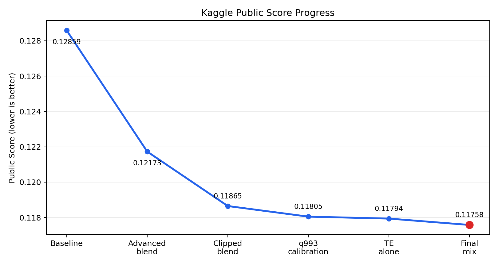
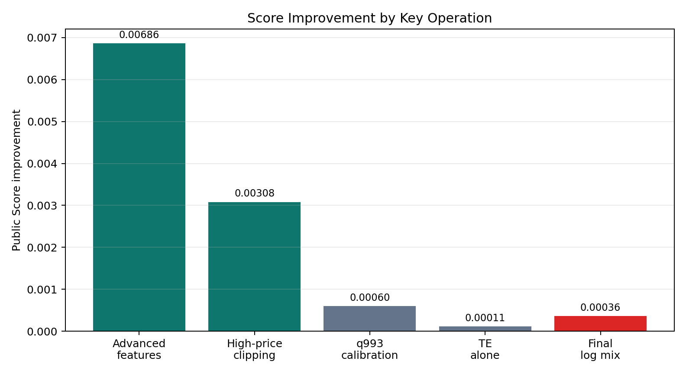
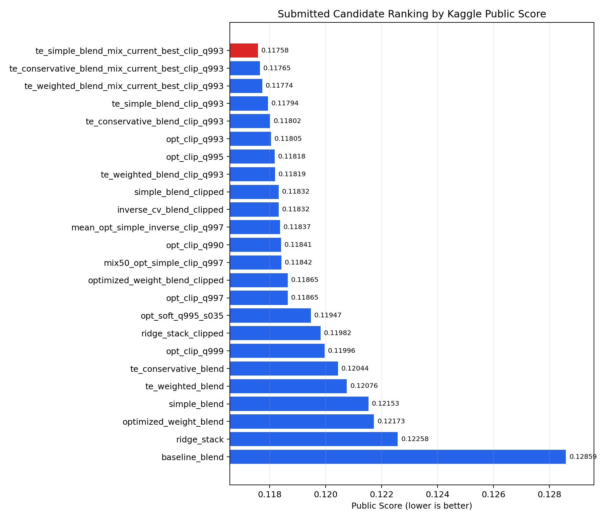
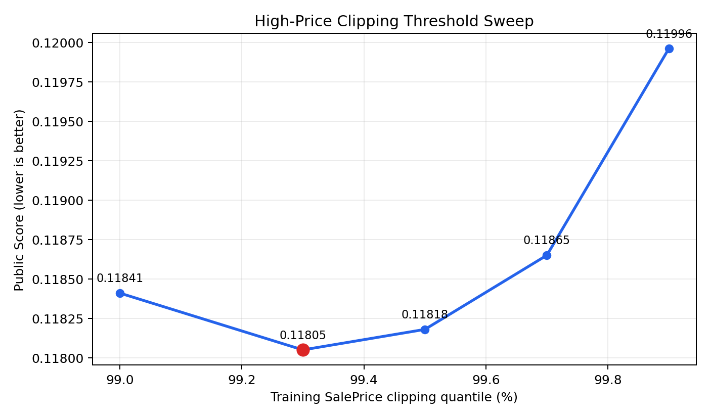
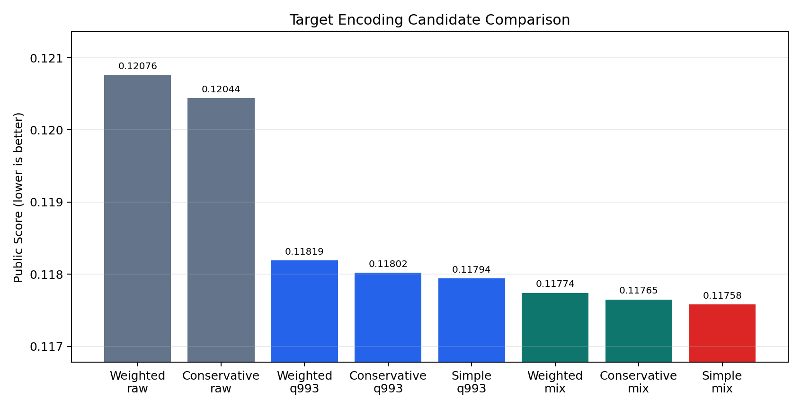

# 7. 实验过程与结果分析

## 7.1 本章目的

前几章已经说明了数据特点、预处理方法、特征工程和模型体系。本章进一步按照实验迭代顺序，总结不同方案对 Kaggle Public Score 的实际影响。

本项目最终以 Kaggle Public Score 作为判断方案优劣的标准。本地交叉验证分数主要用于训练阶段的参考和候选方案筛选，但不作为最终结论依据。因此，本章重点讨论已经实际提交并获得 Kaggle 分数反馈的操作，包括高级特征工程、多模型融合、高价预测裁剪、Target Encoding 以及最终的 log 空间融合。

## 7.2 实验结果总览

从初始 baseline 到最终方案，Public Score 从 `0.12859` 提升到 `0.11758`。主要结果如下表所示。



| 阶段 | 代表方案 | Public Score | 相对上一关键阶段变化 | 主要作用 |
| --- | --- | ---: | ---: | --- |
| Baseline | 基础预处理与四模型平均融合 | 0.12859 |  | 跑通完整建模与提交流程，建立初始参照 |
| 高级特征与多模型融合 | 高级特征工程 + optimized weight blend | 0.12173 | -0.00686 | 高级预处理、更多模型和 OOF 权重融合显著优于 baseline |
| 高级融合后高价裁剪 | optimized weight blend + q997 附近裁剪 | 0.11865 | -0.00308 | 对过高预测做上限控制后，Kaggle 分数明显改善 |
| 高价校准 | optimized weight blend + q993 硬裁剪 | 0.11805 | -0.00060 | q993 是本轮测试中更合适的高价上限 |
| Target Encoding 独立方案 | TE simple blend + q993 裁剪 | 0.11794 | -0.00011 | OOF Target Encoding 简单融合配合 q993 裁剪后略优于上一轮 q993 裁剪 |
| 最终融合方案 | TE simple blend 与上一轮最优做 50/50 log 融合 | 0.11758 | -0.00036 | TE 与上一轮最优方案存在互补性，简单 TE 融合后取得当前最好成绩 |

从阶段贡献看，高级特征工程与多模型融合带来了最大幅度提升；高价裁剪是第二个明显有效的改进；随后 q993 阈值校准和 Target Encoding 融合带来较小但真实的增量。



除主线方案外，项目还提交了多个候选文件，用于比较简单融合、权重融合、stacking、不同裁剪阈值、软压缩和 Target Encoding 融合等方案。下图展示所有已获得 Kaggle Public Score 的候选结果，分数越低表示结果越好。



表格来源：

- `experiments/experiment_log.csv`
- `reports/final_report/tables/experiment_results_summary.csv`
- `reports/final_report/figures/`

## 7.3 Baseline 实验

第一阶段的目标是建立一个可运行、可提交、可复现的基础流程。该版本使用基础缺失值处理、简单人工特征、one-hot 编码和 `RobustScaler`，并训练 Ridge、Lasso、ElasticNet、GradientBoostingRegressor 等模型，最后对表现较好的模型做简单平均融合。

baseline 的提交文件为：

```text
outputs/submission_baseline.csv
```

Kaggle Public Score 为：

```text
0.12859
```

这一结果说明基础流程是有效的，但分数仍有明显提升空间。从后续实验看，baseline 的主要不足在于：特征工程还不够充分，模型种类较少，对高价预测尾部缺少控制，也没有充分利用类别变量中的价格水平信息。

## 7.4 高级特征工程与多模型融合

第二阶段在 baseline 基础上进行了较大幅度改造，主要包括：

1. 更完整的缺失值语义处理和缺失指示器。
2. 对偏态数值变量进行 `log1p` 变换。
3. 补充面积、房龄、比例、设施存在性和质量交互特征。
4. 引入 Kernel Ridge、SVR、XGBoost、LightGBM、CatBoost 等模型。
5. 使用 OOF 预测进行多模型融合，包括简单平均、反比分数加权、非负权重优化和 Ridge stacking。

这一阶段的关键提交结果如下：

| 提交文件 | Public Score | 说明 |
| --- | ---: | --- |
| `20260506_simple_blend.csv` | 0.12153 | 七个核心模型等权融合 |
| `20260506_optimized_weight_blend.csv` | 0.12173 | 非负权重优化融合 |
| `20260506_ridge_stack.csv` | 0.12258 | Ridge stacking |

与 baseline 的 `0.12859` 相比，高级特征与多模型融合已经带来明显提升。其中 `simple_blend` 和 `optimized_weight_blend` 均进入 `0.122` 左右，说明高级预处理、特征工程和多模型体系对结果有实质贡献。

不过，未裁剪版本的分数仍停留在 `0.121` 附近。后续实验发现，模型主体已经有较好预测能力，但部分测试样本的高价预测偏高，会明显拉低 Kaggle 分数。

## 7.5 高价预测裁剪

第三阶段没有重新训练模型，而是直接对已有预测结果进行后处理。其核心操作是对预测房价设置上限，限制极端高价预测。

这一操作的效果非常明显：

| 方案 | Public Score |
| --- | ---: |
| `20260506_optimized_weight_blend.csv` | 0.12173 |
| `20260506_optimized_weight_blend_clipped.csv` | 0.11865 |

两者底层模型相同，主要区别是后者对高价预测做了裁剪。Public Score 从 `0.12173` 提升到 `0.11865`，改善了 `0.00308`。这说明在当前模型下，极端高价预测确实对 Kaggle 分数有负面影响，裁剪是一个实际有效的结果改进操作。

同样的现象也出现在 Ridge stacking 上：

| 方案 | Public Score |
| --- | ---: |
| `20260506_ridge_stack.csv` | 0.12258 |
| `20260506_ridge_stack_clipped.csv` | 0.11982 |

虽然 Ridge stacking 本身不是最终最优方案，但裁剪后同样明显改善，进一步说明高价后处理不是偶然现象。

## 7.6 高价裁剪阈值校准

在确认裁剪有效后，第四阶段进一步比较不同高价上限。候选方案主要基于 `optimized_weight_blend`，使用训练集 `SalePrice` 的不同高分位数作为裁剪阈值。

关键结果如下：

| 裁剪方案 | 上限含义 | Public Score |
| --- | --- | ---: |
| `20260507_opt_clip_q990.csv` | 训练集 99.0% 分位数 | 0.11841 |
| `20260507_opt_clip_q993.csv` | 训练集 99.3% 分位数 | 0.11805 |
| `20260507_opt_clip_q995.csv` | 训练集 99.5% 分位数 | 0.11818 |
| `20260507_opt_clip_q997.csv` | 训练集 99.7% 分位数 | 0.11865 |
| `20260507_opt_clip_q999.csv` | 训练集 99.9% 分位数 | 0.11996 |
| `20260507_opt_soft_q995_s035.csv` | q995 以上软压缩 | 0.11947 |



结果表明，硬裁剪优于软压缩；在已提交的硬裁剪方案中，q993 上限效果最好。q990 的分数变差，说明裁剪不是越强越好，测试集中仍然可能存在真实高价房；q995、q997 和 q999 逐步放松上限后分数也变差，说明原模型仍有明显高价过估。综合来看，q993 是这一阶段最合适的全局高价上限。

这一阶段的最好文件为：

```text
submissions/calibration_20260507/20260507_opt_clip_q993.csv
```

Public Score 为：

```text
0.11805
```

## 7.7 Target Encoding 实验

第五阶段开始重新从特征层面寻找增量。由于 EDA 显示 `Neighborhood`、`MSSubClass`、`SaleType`、`HouseStyle` 等类别变量具有明显价格分层，因此本项目引入 OOF Target Encoding 特征，用类别或类别组合的目标均值信息补充原有 one-hot 特征。

为避免目标泄漏，训练集 Target Encoding 使用 OOF 方式生成：每个验证 fold 的编码只由其他训练 fold 计算；测试集编码则使用完整训练集统计，并加入平滑处理。本轮共构造 20 个 TE 特征，包括单字段 TE 和组合字段 TE。

本轮训练了 `te_ridge`、`te_elastic_net`、`te_kernel_ridge`、`te_svr`、`te_xgboost`、`te_lightgbm`、`te_catboost` 等模型，并生成三类融合结果：

- `te_simple_blend`：等权融合。
- `te_weighted_blend`：基于 OOF 的权重优化融合。
- `te_conservative_blend`：等权融合与优化权重融合各占 50%，用于降低过度依赖权重优化的风险。

TE 相关提交结果如下：

| 提交文件 | Public Score | 说明 |
| --- | ---: | --- |
| `20260507_te_weighted_blend.csv` | 0.12076 | 未裁剪 TE 优化权重融合，高价尾部控制不足 |
| `20260507_te_conservative_blend.csv` | 0.12044 | 未裁剪 TE 保守融合，仍明显差于裁剪版本 |
| `20260507_te_weighted_blend_clip_q993.csv` | 0.11819 | 纯 TE 优化权重融合，略差于上一轮最好 |
| `20260507_te_conservative_blend_clip_q993.csv` | 0.11802 | 纯 TE 保守融合，略优于上一轮 q993 方案 |
| `20260507_te_simple_blend_clip_q993.csv` | 0.11794 | 纯 TE 简单融合，是当前最好的独立 TE 方案 |
| `20260507_te_weighted_blend_mix_current_best_clip_q993.csv` | 0.11774 | TE weighted 与上一轮最好方案做 50/50 log 融合 |
| `20260507_te_conservative_blend_mix_current_best_clip_q993.csv` | 0.11765 | TE conservative 与上一轮最好方案做 50/50 log 融合 |
| `20260507_te_simple_blend_mix_current_best_clip_q993.csv` | 0.11758 | 当前最好成绩 |



从结果看，Target Encoding 作为独立方案已经能达到 `0.11794`，略优于上一轮 `0.11805`。更重要的是，当 TE 方案与上一轮最好方案做 50/50 log 融合后，Public Score 进一步提升到 `0.11758`。这说明 TE 捕捉到的类别价格水平信息与原有高级特征融合方案存在互补性。

这一组补充提交还修正了一个更细的判断：最终最好的不是本地 CV 更低的 weighted TE，也不是折中的 conservative TE，而是 simple TE 融合。说明在小样本表格任务中，OOF 权重优化未必带来最好的线上泛化；更均衡的简单融合反而可能保留更多互补误差信号。

因此，本项目对 Target Encoding 的结论是：TE 不是简单替代原方案的“大幅单独提升”，但它作为互补特征体系确实带来了实际分数提升，是最终方案中的关键组成部分。

## 7.8 最终结果分析

最终最好提交文件为：

```text
submissions/model_redesign_20260507/target_encoding/20260507_te_simple_blend_mix_current_best_clip_q993.csv
```

Public Score 为：

```text
0.11758
```

与 baseline 相比，分数变化为：

```text
0.12859 -> 0.11758
```

累计改善：

```text
0.01101
```

从实验路径看，真正对结果产生影响的操作主要包括：

1. 高级预处理和特征工程，使模型从 `0.12859` 提升到约 `0.121`。
2. 多模型融合，使不同模型误差互补，形成比单模型更稳的提交。
3. 高价硬裁剪，使 `optimized_weight_blend` 从 `0.12173` 提升到 `0.11865`，并通过 q993 校准进一步提升到 `0.11805`。
4. OOF Target Encoding 捕捉类别价格水平信息，使纯 TE simple blend + q993 裁剪达到 `0.11794`。
5. TE 方案与上一轮最优方案做 50/50 log 融合，最终达到 `0.11758`。

这些结果表明，本项目的分数提升并不是由单一复杂模型带来的，而是由数据理解、特征工程、模型融合、预测后处理和类别信息增量共同作用形成的。

## 7.9 本章小结

本章按照实验顺序回顾了从 baseline 到最终方案的主要改进。实验结果显示，单纯增加模型复杂度并不足以得到最好成绩；真正有效的路径是先建立稳健的预处理和多模型融合体系，再根据 Kaggle 反馈对高价尾部进行裁剪校准，最后利用 Target Encoding 提供新的类别信息增量。

最终方案的 Kaggle Public Score 为 `0.11758`，明显优于初始 baseline 的 `0.12859`。这一结果说明本项目形成了一条较完整、可复现且实际有效的房价预测建模流程。

## 7.10 本章引用材料

- `experiments/experiment_log.csv`
- `reports/20260506_optimization_round_report.md`
- `reports/20260507_calibration_round_report.md`
- `reports/20260507_calibration_feedback_review.md`
- `reports/modeling/20260507_target_encoding_experiment_report.md`
- `reports/final_report/tables/experiment_results_summary.csv`
