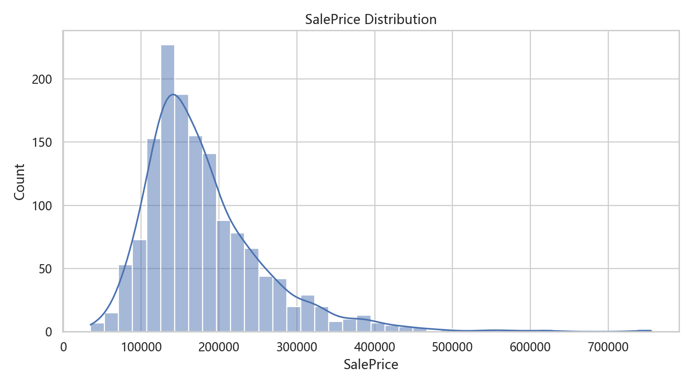
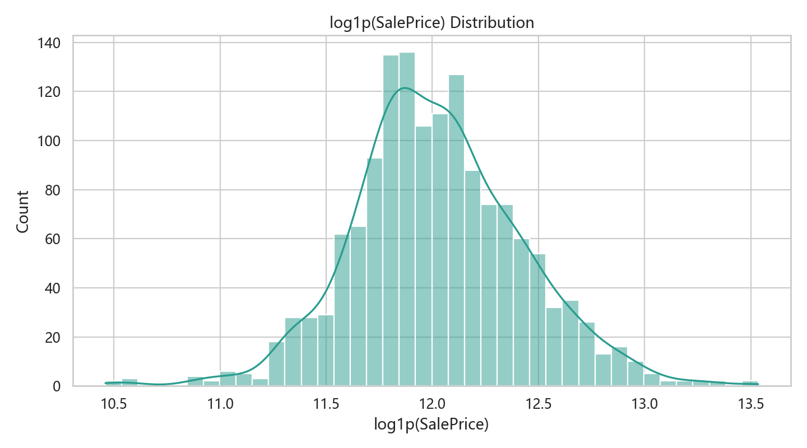
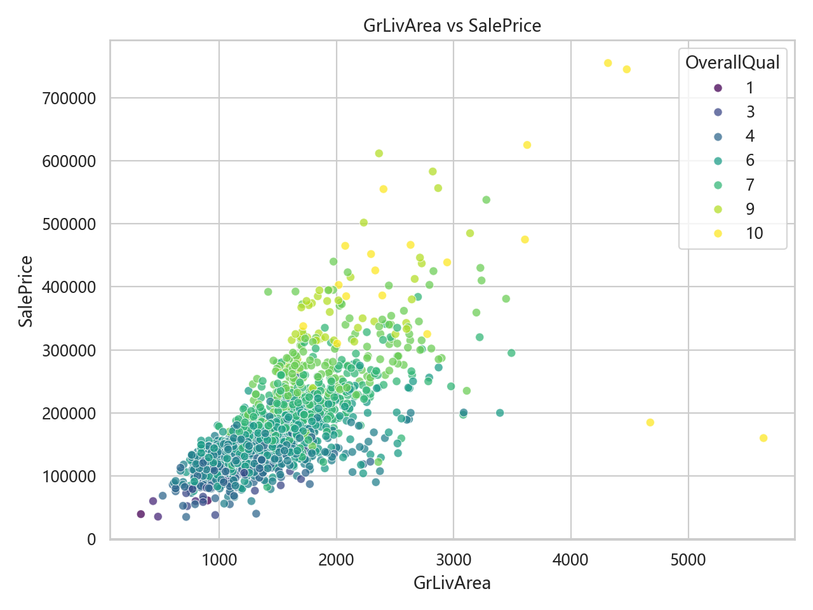
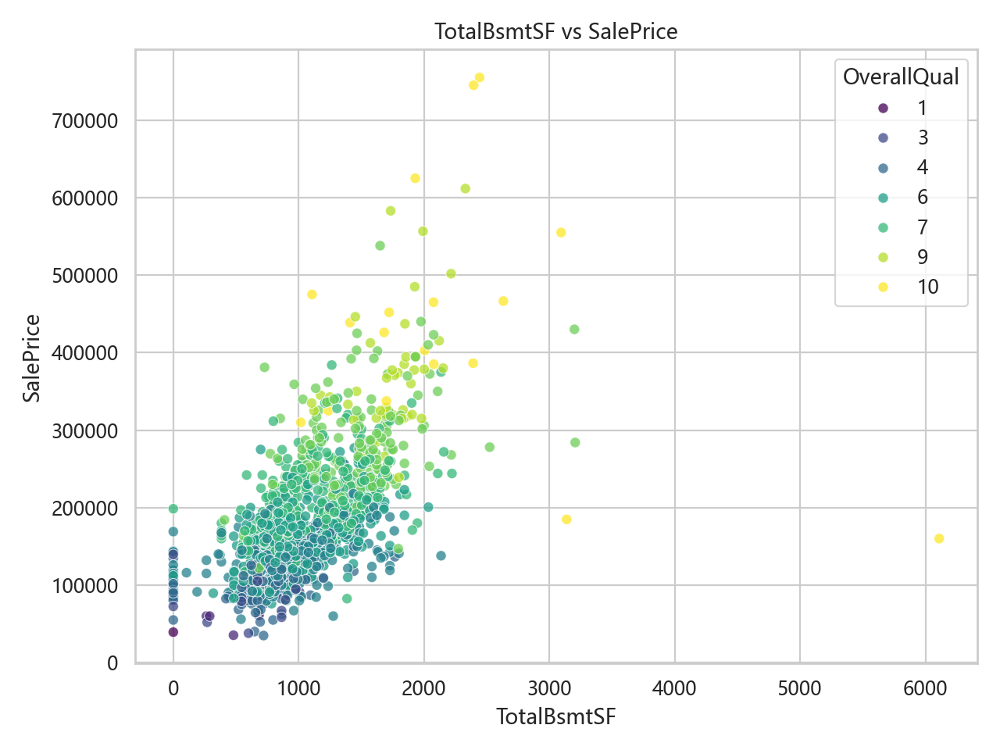
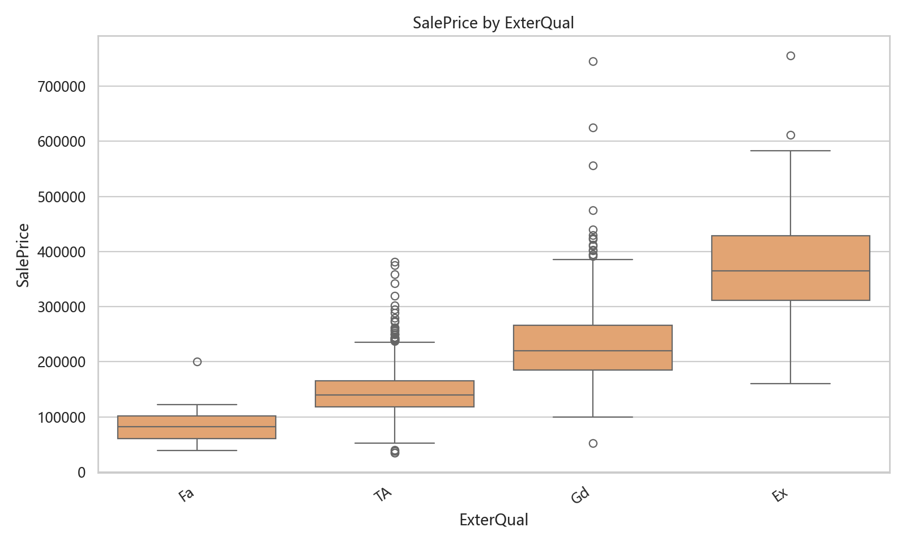
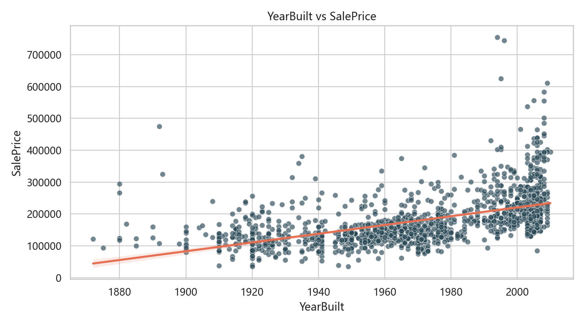
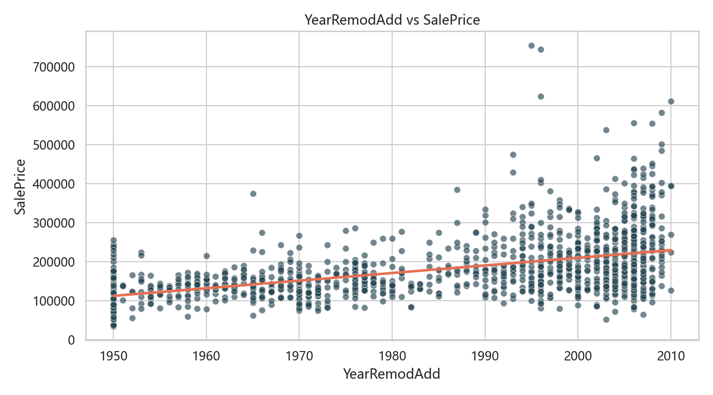
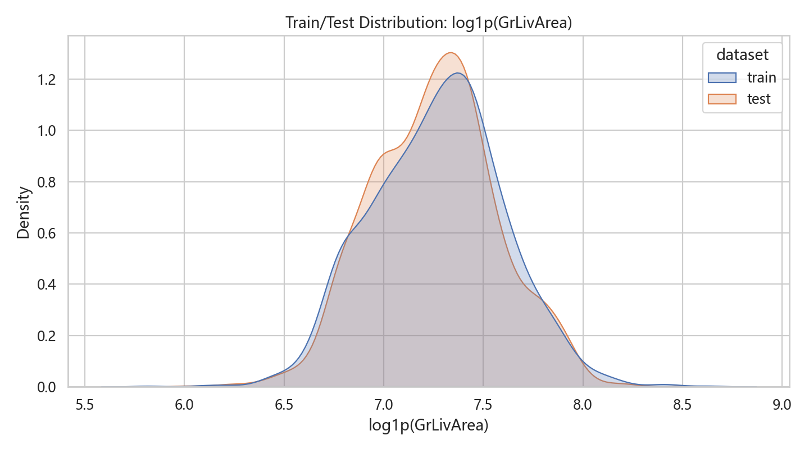

# Kaggle House Prices 房价预测数据挖掘报告

# 1. 项目背景与任务说明

## 1.1 项目背景

本项目选取 Kaggle 入门竞赛 **House Prices - Advanced Regression Techniques** 作为数据挖掘期末大作业的实践对象。该竞赛提供了美国 Ames, Iowa 房屋交易数据，要求参赛者根据房屋的结构、位置、面积、质量、年份、交易条件等属性预测房屋最终销售价格。

房价预测是结构化数据挖掘中的典型回归任务。它既具有清晰的业务含义，又包含许多现实数据问题，例如缺失值、异常值、类别变量、高偏态分布、特征交互和模型泛化误差。因此，这个任务适合用于完整展示数据理解、探索性分析、数据预处理、特征工程、模型训练、模型融合和结果评估等流程。

本项目的目标不是单纯追求排行榜极限分数，而是建立一套完整、可解释、可复现的房价预测流程，并通过多轮实验逐步改进模型效果。

## 1.2 预测任务

本项目的预测目标变量为 `SalePrice`，即房屋销售价格。训练集中每条样本包含一套房屋的属性信息及其实际销售价格；测试集中只提供房屋属性，需要模型预测对应的销售价格。

从机器学习任务类型看，本项目属于监督学习中的回归问题。输入变量包括：

- 数值型变量，例如房屋面积、地块面积、车库面积、地下室面积等。
- 等级型变量，例如整体质量、外部材料质量、厨房质量、地下室质量等。
- 类别型变量，例如社区位置、住宅类型、销售类型、建筑风格等。
- 时间型变量，例如建造年份、翻新年份、销售年份和销售月份等。

这些变量共同描述了房屋的空间规模、建筑质量、地理位置、设施条件和交易背景。模型需要从这些变量中学习房屋属性与销售价格之间的关系。

## 1.3 评价指标

Kaggle 竞赛使用 RMSLE 作为评价指标。RMSLE 的核心思想是先对真实价格和预测价格取对数，再计算均方根误差。其形式可以理解为：

```text
RMSLE = sqrt(mean((log(1 + y_pred) - log(1 + y_true))^2))
```

这一指标有两个重要特点：

1. 它更关注相对误差，而不是绝对误差。对于房价这种跨度较大的变量，预测 10 万美元房屋误差 1 万美元，与预测 50 万美元房屋误差 1 万美元，其业务含义并不完全相同。
2. 它会降低高价长尾样本对模型训练和评分的冲击，使模型更关注整体比例上的预测准确性。

因此，本项目在训练过程中对目标变量使用 `log1p(SalePrice)` 变换，在生成提交文件时再使用 `expm1` 将预测值还原为原始价格尺度。这一点与 Kaggle 的 RMSLE 评价方式保持一致。

## 1.4 项目流程

本项目按照数据挖掘的一般流程展开：

1. 数据理解：读取训练集、测试集和字段说明，理解样本规模、变量类型和预测目标。
2. 探索性数据分析：分析目标变量分布、缺失值、关键特征与房价关系、训练集与测试集差异。
3. 数据预处理：处理缺失值、异常值、偏态变量和类别变量编码。
4. 特征工程：构造面积、质量、年份、设施存在性和 Target Encoding 等特征。
5. 模型训练：训练线性模型、核方法、SVR、XGBoost、LightGBM、CatBoost 等模型。
6. 模型融合：使用简单平均、OOF 权重优化、保守融合和 log 融合提升稳定性。
7. 验证与提交：比较本地 CV、预测分布风险和 Kaggle Public Score。
8. 结果总结：分析每轮实验的改进效果，并确定阶段最终方案。

## 1.5 当前成果概览

项目经过多轮实验后，最终采用了高级特征工程、多模型融合、高价尾部裁剪、OOF Target Encoding 和当前最好方案的 50/50 log 融合。当前最佳提交文件为：

```text
20260507_te_simple_blend_mix_current_best_clip_q993.csv
```

对应 Kaggle Public Score 为：

```text
0.11758
```

这一结果已经明显优于最初 baseline 的 `0.12859`。从实验过程看，主要有效改进来自目标变量 log 变换、高级特征工程、多模型融合、高价尾部控制，以及 Target Encoding 提供的增量信息。


# 2. 数据集说明

## 2.1 数据来源与文件组成

本项目使用 Kaggle House Prices 竞赛提供的数据文件。原始数据目录中包含：

- `train.csv`：训练集，包含房屋属性和目标变量 `SalePrice`。
- `test.csv`：测试集，包含房屋属性，不包含 `SalePrice`。
- `sample_submission.csv`：Kaggle 要求的提交文件格式示例。
- `data_description.txt`：字段说明文档，解释各个变量的业务含义。

在项目代码中，数据通过 `house_price.data.load_raw_data` 统一读取。训练集和测试集后续会经过相同的预处理与特征工程流程，以保证训练和预测阶段的特征空间一致。

## 2.2 数据规模

根据报告材料生成脚本统计，原始数据规模如下：

| 数据集 | 行数 | 列数 | 特征列数 | 是否包含 SalePrice | 缺失单元格 | 重复行 |
| --- | ---: | ---: | ---: | --- | ---: | ---: |
| train | 1460 | 81 | 80 | yes | 7829 | 0 |
| test | 1459 | 80 | 80 | no | 7878 | 0 |
| sample_submission | 1459 | 2 | 0 | yes | 0 | 0 |

训练集包含 1460 条样本，测试集包含 1459 条样本。训练集比测试集多一列 `SalePrice`，其余 80 个字段为房屋属性。数据集中没有重复行。

本节表格来源：

- `reports/final_report/tables/dataset_profile.csv`

## 2.3 特征类型

从数据类型看，训练集中除目标变量外共有 80 个原始特征。其中：

| 数据类型 | 特征数量 |
| --- | ---: |
| float64 | 3 |
| int64 | 34 |
| str | 43 |

可以看到，类别型变量数量较多，这也是本任务的一个重要特点。房价不仅由面积、年份等连续数值决定，也受到社区、建筑类型、质量等级、交易条件等类别信息影响。

本节表格来源：

- `reports/final_report/tables/feature_type_summary.csv`

## 2.4 特征业务分组

根据字段含义，可以将原始特征划分为以下几类：

| 特征组 | 特征数量 | 示例特征 |
| --- | ---: | --- |
| 房屋类型与 zoning | 4 | `MSSubClass`, `MSZoning`, `BldgType`, `HouseStyle` |
| 地块与位置 | 12 | `LotFrontage`, `LotArea`, `Street`, `Alley`, `Neighborhood`, `Condition1` |
| 建筑质量与材料 | 11 | `OverallQual`, `OverallCond`, `Exterior1st`, `Exterior2nd`, `ExterQual`, `Foundation` |
| 地下室 | 9 | `BsmtQual`, `BsmtCond`, `BsmtExposure`, `BsmtFinSF1`, `TotalBsmtSF` |
| 室内面积与功能 | 19 | `GrLivArea`, `1stFlrSF`, `2ndFlrSF`, `FullBath`, `KitchenQual`, `Fireplaces` |
| 车库 | 7 | `GarageType`, `GarageYrBlt`, `GarageFinish`, `GarageCars`, `GarageArea` |
| 外部设施 | 11 | `WoodDeckSF`, `OpenPorchSF`, `PoolArea`, `PoolQC`, `Fence`, `MiscFeature` |
| 时间与交易 | 6 | `YearBuilt`, `YearRemodAdd`, `MoSold`, `YrSold`, `SaleType`, `SaleCondition` |

这种分组有助于后续解释特征工程。例如，面积类变量适合构造总面积，质量类变量适合构造综合质量，年份类变量适合转换为房龄和翻新时间，设施类变量则常常需要结合缺失值含义构造“是否存在该设施”的二值特征。

本节表格来源：

- `reports/final_report/tables/feature_domain_groups.csv`

## 2.5 目标变量 SalePrice 概况

训练集目标变量 `SalePrice` 的统计情况如下：

| 变量 | 均值 | 标准差 | 最小值 | 中位数 | 95% 分位数 | 最大值 | 偏度 |
| --- | ---: | ---: | ---: | ---: | ---: | ---: | ---: |
| SalePrice | 180921.20 | 79442.50 | 34900.00 | 163000.00 | 326100.00 | 755000.00 | 1.8829 |
| log1p(SalePrice) | 12.0241 | 0.3994 | 10.4603 | 12.0015 | 12.6950 | 13.5345 | 0.1213 |

原始 `SalePrice` 呈现明显右偏分布，最大值达到 755000，远高于中位数 163000。对目标变量进行 `log1p` 变换后，偏度从 1.8829 降到 0.1213，分布更接近对称。这一结果支持后续建模中使用 log 目标变量。

本节表格来源：

- `reports/final_report/tables/target_summary_for_report.csv`
- `reports/eda/figures/target_distribution.png`
- `reports/eda/figures/target_log_distribution.png`

## 2.6 缺失值概况

原始数据中存在较多缺失值，但这些缺失值并不都表示数据质量问题。很多字段的缺失具有明确业务含义，例如：

- `Alley` 缺失通常表示没有巷道通道。
- `PoolQC` 缺失通常表示没有泳池。
- `Fence` 缺失通常表示没有围栏。
- 地下室相关字段缺失通常表示没有地下室。
- 车库相关字段缺失通常表示没有车库。

整体缺失情况如下：

| 数据集 | 存在缺失的特征数 | 缺失单元格数 | 缺失单元格比例 | 缺失最多的字段示例 |
| --- | ---: | ---: | ---: | --- |
| train | 19 | 7829 | 6.6202% | `PoolQC`, `MiscFeature`, `Alley`, `Fence`, `MasVnrType`, `FireplaceQu`, `LotFrontage`, `GarageType` |
| test | 33 | 7878 | 6.7489% | `PoolQC`, `MiscFeature`, `Alley`, `Fence`, `MasVnrType`, `FireplaceQu`, `LotFrontage`, `GarageYrBlt` |

因此，本项目后续并不是简单删除缺失值，而是结合字段含义进行分组处理。对于“设施不存在”类缺失，通常填充为 `None` 或 0；对于少数真正未知的数值缺失，再使用中位数或其他稳健策略进行填充。

本节表格来源：

- `reports/final_report/tables/missing_overview.csv`
- `reports/eda/tables/missing_train.csv`
- `reports/eda/tables/missing_test.csv`
- `reports/eda/figures/missing_train.png`
- `reports/eda/figures/missing_test.png`

## 2.7 数据集特点总结

综合来看，本数据集具有以下特点：

1. 样本量较小，训练集只有 1460 条记录，因此模型验证容易受到样本划分影响。
2. 特征数量较多，且类别型变量占比较高，需要认真处理类别编码。
3. 目标变量价格分布右偏明显，需要进行 log 变换。
4. 缺失值数量较多，但很多缺失具有业务含义，不能简单视为异常。
5. 房价受多类因素共同影响，包括位置、面积、质量、年份、设施和交易条件。
6. 高价房形成长尾，后续实验表明高价尾部预测会明显影响 Kaggle 提交分数。

这些特点决定了本项目不能只依赖单一模型或简单预处理，而需要结合 EDA、稳健预处理、特征工程、多模型融合和预测分布检查，逐步提高模型效果。

## 2.8 本章补充材料

为了支撑本章写作，本轮新增了报告材料生成脚本：

```powershell
conda run -n kaggle_house python scripts/generate_final_report_tables.py
```

该脚本生成的表格位于：

```text
reports/final_report/tables/
```

包含：

- `dataset_profile.csv`
- `feature_type_summary.csv`
- `feature_domain_groups.csv`
- `missing_overview.csv`
- `target_summary_for_report.csv`

# 3. 数据理解与探索性数据分析

## 3.1 分析目的

探索性数据分析的目标是理解数据结构、识别影响房价的关键因素，并为后续预处理、特征工程和建模策略提供依据。本项目的 EDA 不仅用于展示数据分布，还直接影响了后续建模决策，例如目标变量 log 变换、异常值删除、缺失值语义填充、质量类变量序数编码、高价尾部控制等。

本章主要围绕以下问题展开：

- `SalePrice` 是否存在偏态分布，是否需要变换？
- 哪些数值特征与房价关系最强？
- 类别变量是否具有明显价格分层？
- 缺失值是数据质量问题，还是业务含义的一部分？
- 训练集与测试集分布是否存在明显差异？
- 是否存在会干扰模型学习的异常样本？

## 3.2 目标变量分布

训练集目标变量 `SalePrice` 的原始分布明显右偏。大部分房屋价格集中在中低价区间，少数高价房形成长尾。统计上，原始 `SalePrice` 的偏度为 `1.8829`，最大值为 `755000`，显著高于中位数 `163000`。



对 `SalePrice` 进行 `log1p` 变换后，分布明显更接近对称，偏度下降到 `0.1213`。这说明 log 变换能够有效缓解高价长尾对模型训练的影响。



这一观察直接决定了后续建模策略：训练阶段使用 `log1p(SalePrice)` 作为目标变量，预测后再通过 `expm1` 还原为原始价格。该处理方式也与 Kaggle 的 RMSLE 指标一致。

引用材料：

- `reports/final_report/tables/target_summary_for_report.csv`
- `reports/eda/tables/target_summary.csv`

## 3.3 缺失值结构

训练集和测试集都存在较多缺失单元格。训练集共有 7829 个缺失单元格，测试集共有 7878 个缺失单元格。缺失最多的字段包括 `PoolQC`、`MiscFeature`、`Alley`、`Fence`、`MasVnrType`、`FireplaceQu`、`LotFrontage` 等。


从字段含义看，许多高缺失字段并不是普通意义上的脏数据。例如：

- `PoolQC` 缺失通常表示房屋没有泳池。
- `Alley` 缺失通常表示没有巷道通道。
- `Fence` 缺失通常表示没有围栏。
- `FireplaceQu` 缺失通常表示没有壁炉。
- `Garage*` 系列字段缺失通常表示没有车库。
- `Bsmt*` 系列字段缺失通常表示没有地下室。

因此，后续预处理中不能简单删除缺失值，也不应对所有缺失值机械地填充均值。更合理的方式是结合业务含义，将“设施不存在”类缺失填充为 `None` 或 0，并为缺失字段保留缺失指示器。

引用材料：

- `reports/final_report/tables/missing_overview.csv`
- `reports/eda/tables/missing_train.csv`
- `reports/eda/tables/missing_test.csv`

## 3.4 数值特征与房价关系

相关性分析显示，`OverallQual` 是与房价相关性最高的单一数值特征，相关系数为 `0.7910`。此外，`GrLivArea`、`GarageCars`、`GarageArea`、`TotalBsmtSF`、`1stFlrSF` 等面积或容量相关变量也与房价高度相关。


这说明房价主要受以下几类因素影响：

- 房屋整体质量
- 居住面积和地下室面积
- 车库容量和车库面积
- 卫浴数量和房间数量
- 建造年份和翻新年份

这些观察支撑了后续构造面积组合特征、质量交互特征和年份差值特征的做法。

引用材料：

- `reports/eda/tables/numeric_correlations.csv`
- `reports/eda/figures/correlation_bar.png`
- `reports/eda/figures/correlation_heatmap.png`

## 3.5 面积变量分析

`GrLivArea` 表示地上居住面积，是房价预测中最关键的面积变量之一。散点图显示，`GrLivArea` 与 `SalePrice` 整体呈明显正相关关系，面积越大，房价通常越高。



但图中也存在两个经典异常点：`Id=524` 和 `Id=1299`。这两个样本的 `GrLivArea` 极大，但销售价格相对偏低，会干扰模型学习“面积越大价格越高”的主趋势。因此，后续正式训练前删除了这两个训练样本。

`TotalBsmtSF` 与房价也呈正相关，但关系不如 `GrLivArea` 线性。地下室面积仍然具有价值，但更适合与其他面积变量组合，例如总面积、完成地下室面积比例等。



## 3.6 质量变量分析

`OverallQual` 描述房屋整体材料和完成质量，是最强的单一特征。箱线图显示，随着 `OverallQual` 等级提高，房价中位数稳定上升，价格分布也整体上移。


质量类变量的建模启发是：这类变量具有天然顺序，适合进行序数编码。例如 `Ex > Gd > TA > Fa > Po`，如果完全 one-hot，可能损失等级顺序信息。因此后续对 `ExterQual`、`KitchenQual`、`BsmtQual`、`GarageQual` 等变量进行了有序数值映射。

引用材料：

- `reports/eda/tables/overallqual_price.csv`

## 3.7 类别变量与位置因素

类别变量中，`Neighborhood` 的价格分层最明显。不同社区的房价中位数差异较大，例如 `NridgHt`、`NoRidge`、`StoneBr` 等社区整体价格较高，而 `MeadowV`、`IDOTRR`、`BrDale` 等社区整体价格较低。


这说明 `Neighborhood` 不是普通无信息类别，而是携带了强烈的位置溢价、社区档次和房屋结构差异。后续建模中既保留了 one-hot 编码，也在 Target Encoding 实验中重点使用了 `Neighborhood` 及其与质量、住宅类型的组合。

其他类别变量也有明显作用。例如，`ExterQual` 随质量等级提升呈现清晰价格分层；`HouseStyle` 不同类别之间也存在一定价格差异。




引用材料：

- `reports/eda/tables/neighborhood_price.csv`
- `reports/eda/tables/categorical_cardinality.csv`

## 3.8 年份变量分析

年份变量能够反映房屋新旧程度。`YearBuilt` 与房价整体正相关，新建房屋通常价格更高；`YearRemodAdd` 也呈类似趋势，说明翻新年份较新的房屋通常更有价值。





原始年份本身不是最直接的业务表达。后续特征工程中，将年份转换为 `HouseAge = YrSold - YearBuilt`、`RemodAge = YrSold - YearRemodAdd`，并构造是否翻新、是否新房等二值变量，使特征更接近业务含义。

## 3.9 训练集与测试集分布对比

训练集与测试集在核心变量上整体分布接近。例如 `GrLivArea`、`OverallQual` 的主要分布区域相似，这为模型泛化提供了基本前提。




但部分变量仍存在偏态或尾部差异，例如 `LotArea` 的右偏非常明显，因此需要对偏态数值变量进行变换，并在训练和测试上使用完全一致的预处理流程。


引用材料：

- `reports/eda/tables/train_test_numeric_drift.csv`
- `reports/eda/tables/train_test_categorical_drift.csv`

## 3.10 EDA 对建模策略的启发

综合以上分析，EDA 对后续建模形成了以下直接指导：

1. `SalePrice` 右偏明显，应使用 `log1p(SalePrice)` 作为训练目标。
2. `GrLivArea` 极大但价格偏低的两个异常样本应从训练集中删除。
3. 缺失值需要按业务语义处理，不能简单删除。
4. 面积、质量、年份、设施存在性应作为特征工程重点。
5. 质量类变量具有顺序，应使用序数编码。
6. `Neighborhood` 等强类别变量应重点保留，并可尝试 Target Encoding。
7. 偏态数值变量需要 log 变换。
8. 高价尾部样本会显著影响提交结果，后续需要检查预测分布并控制高价外推风险。

这些结论贯穿了后续的数据预处理、特征工程、模型融合和高价尾部校准过程。


# 4. 数据预处理

## 4.1 预处理目标

数据预处理的目标是将原始房屋属性数据转换为稳定、无缺失、可编码、可用于模型训练的基础数据矩阵。由于本数据集同时包含数值变量、类别变量、等级变量、缺失值、偏态分布和异常样本，预处理不能只做机械填充，而应结合字段含义和模型需求进行处理。

本项目后期正式建模主要使用 `house_price.advanced_preprocessing.build_advanced_feature_matrix`。该流程遵循以下原则：

- 训练集和测试集合并处理，保证编码后特征列一致。
- 缺失值按业务含义分组填充。
- 对原始缺失信息构造缺失指示器。
- 对类别变量区分“有序类别”和“无序类别”。
- 对偏态数值变量进行变换。
- 对最终数值矩阵进行稳健缩放。

## 4.2 异常值处理

在 EDA 中，`Id=524` 和 `Id=1299` 被识别为典型的大面积低价异常样本。这两个样本的 `GrLivArea` 极大，但 `SalePrice` 明显偏低，会削弱模型对“居住面积越大，价格通常越高”这一主趋势的学习。

因此，正式建模前删除满足以下条件的训练样本：

```text
GrLivArea > 4000 且 SalePrice < 300000
```

该处理只应用于训练集，不应用于测试集。原因是测试集没有真实价格，无法判断某个样本是否属于“低价异常”；同时 Kaggle 要求对测试集全部样本给出预测。

处理后，训练样本数由 1460 减少为 1458。

对应代码：

- `house_price/data.py`

## 4.3 目标变量变换

原始 `SalePrice` 呈明显右偏分布，高价房形成长尾。为适配 Kaggle 的 RMSLE 指标，并降低高价样本对训练过程的影响，本项目将目标变量变换为：

```text
y = log1p(SalePrice)
```

模型训练、交叉验证和融合权重学习均在 log 价格尺度上进行。生成提交文件时，再通过：

```text
SalePrice = expm1(y_pred)
```

将预测结果还原为原始价格。

这一处理具有三点作用：

1. 与 RMSLE 指标的计算逻辑一致。
2. 缓解目标变量右偏问题。
3. 使模型更关注相对误差，而不是被少数高价样本的绝对误差主导。

## 4.4 缺失值语义处理

本数据集中的缺失值具有明显业务语义。许多缺失并不表示数据记录错误，而是表示某项设施不存在。因此，本项目按字段含义分组处理缺失值。

### 4.4.1 设施不存在类缺失

部分类别字段缺失表示房屋没有对应设施，例如：

- `PoolQC`：无泳池。
- `MiscFeature`：无杂项设施。
- `Alley`：无巷道通道。
- `Fence`：无围栏。
- `FireplaceQu`：无壁炉。
- `GarageType`、`GarageFinish`、`GarageQual`、`GarageCond`：无车库。
- `BsmtQual`、`BsmtCond`、`BsmtExposure`、`BsmtFinType1`、`BsmtFinType2`：无地下室。

这类字段填充为 `None`，使模型能够学习“设施不存在”本身对价格的影响。

### 4.4.2 面积、数量和年份类缺失

对于与设施不存在对应的数值字段，缺失值填充为 0，例如：

- `GarageYrBlt`
- `GarageArea`
- `GarageCars`
- `BsmtFinSF1`
- `BsmtFinSF2`
- `BsmtUnfSF`
- `TotalBsmtSF`
- `BsmtFullBath`
- `BsmtHalfBath`
- `MasVnrArea`

该处理的业务含义是：如果房屋没有对应设施，则其面积、数量或年份贡献为 0。

### 4.4.3 `LotFrontage` 分组填充

`LotFrontage` 表示临街长度，缺失较多，且与社区位置相关。不同社区的道路条件和地块形态可能不同，因此本项目按 `Neighborhood` 分组，用同社区的中位数填充：

```text
LotFrontage = median(LotFrontage | Neighborhood)
```

这种方式比全局中位数更符合业务语境。

### 4.4.4 少量普通缺失

对于少量类别字段，例如 `MSZoning`、`Electrical`、`KitchenQual`、`Exterior1st`、`Exterior2nd`、`SaleType`、`Utilities`，使用众数填充。对于 `Functional`，缺失值填充为 `Typ`，表示典型功能状态。

在前述规则之后，如仍有数值缺失，则使用中位数填充；如仍有类别缺失，则使用众数或 `None` 填充。

对应代码：

- `house_price/preprocessing.py`
- `house_price/advanced_preprocessing.py`

## 4.5 缺失指示器

在填充缺失值前，高级预处理流程会为所有存在缺失的字段构造缺失指示器：

```text
Column_WasMissing
```

例如，若 `LotFrontage` 原始值缺失，则新增：

```text
LotFrontage_WasMissing = 1
```

这样即使后续完成了数值填充，模型仍能识别该字段是否原本缺失。对于本数据集来说，缺失本身往往含有业务信息，因此缺失指示器是有意义的补充特征。正式建模矩阵中共生成 34 个缺失指示器。

引用材料：

- `reports/final_report/tables/preprocessing_feature_summary.csv`

## 4.6 类别变量基础处理

### 4.6.1 数值形式的类别变量

部分字段虽然在 CSV 中表现为数值，但实际含义是类别。例如：

- `MSSubClass`
- `MoSold`
- `YrSold`

这些字段被转换为字符串，以避免模型误认为类别编号之间存在连续数值距离。

### 4.6.2 有序类别编码

质量类字段具有明确顺序，例如：

```text
Ex > Gd > TA > Fa > Po > None
```

因此，本项目将其映射为数值等级：

```text
Ex=5, Gd=4, TA=3, Fa=2, Po=1, None=0
```

应用该策略的字段包括 `ExterQual`、`ExterCond`、`BsmtQual`、`BsmtCond`、`HeatingQC`、`KitchenQual`、`FireplaceQu`、`GarageQual`、`GarageCond`、`PoolQC` 等。

此外，`LotShape`、`LandSlope`、`BsmtExposure`、`BsmtFinType1`、`Functional`、`GarageFinish`、`PavedDrive` 等字段也根据其等级含义进行了有序映射。

### 4.6.3 无序类别 one-hot 编码

对没有明确顺序的普通类别变量，使用 one-hot 编码。为了保证训练集和测试集列空间一致，编码前先将训练集和测试集合并，完成缺失值处理、类别转换和编码后，再拆分为训练矩阵和测试矩阵。

## 4.7 偏态数值变量处理

对于右偏较强、取值非负、唯一值数量较多的数值变量，使用 `log1p` 变换。正式建模中共有 27 个数值列执行了偏态修正，例如：

- `LotFrontage`
- `LotArea`
- `MasVnrArea`
- `TotalBsmtSF`
- `GrLivArea`
- `TotalSF`
- `TotalLivingSF`
- `TotalFinishedSF`

该处理降低了极端值对模型训练的影响，使线性模型、核方法和距离敏感模型更加稳定。

引用材料：

- `reports/final_report/tables/skew_transformed_columns.csv`
- `reports/eda/tables/numeric_skewness.csv`

## 4.8 数值缩放

在 one-hot 编码和数值变换完成后，所有数值列使用 `RobustScaler` 进行缩放。与均值方差标准化相比，`RobustScaler` 使用中位数和四分位距，对异常值更稳健。

这一步对 Ridge、ElasticNet、SVR、Kernel Ridge 等模型尤其重要，因为这些模型对特征尺度较敏感。经过缩放后，不同量纲的面积、年份、计数和交互特征可以更稳定地进入同一个模型。

## 4.9 预处理结果

删除 2 个异常训练样本后，正式建模使用的数据规模如下：

| 项目 | 数值 | 说明 |
| --- | ---: | --- |
| 原始训练样本数 | 1460 | 原始训练集 |
| 删除异常点后训练样本数 | 1458 | 正式建模使用 |
| 测试样本数 | 1459 | Kaggle 测试集 |
| 原始特征数 | 80 | 不含 `SalePrice` |
| 高级预处理后基础特征数 | 447 | 不含后期 TE 特征 |
| 缺失指示器特征数 | 34 | `_WasMissing` 特征 |
| 偏态修正数值列数 | 27 | 使用 `log1p` |

引用材料：

- `reports/final_report/tables/preprocessing_feature_summary.csv`

## 4.10 本章小结

本项目的数据预处理不是简单的缺失值填充和编码转换，而是基于 EDA 和字段业务含义进行的系统处理。预处理阶段完成了异常值删除、目标变量变换、语义化缺失值填充、缺失指示器构造、类别变量编码、偏态修正和稳健缩放，为后续特征工程和多模型训练提供了稳定的数据基础。


# 5. 特征工程

## 5.1 特征工程目标

特征工程的目标是在原始字段和基础预处理结果之上，构造更贴近房屋价格形成机制的变量。房价不是由单一因素决定，而是由面积、质量、位置、年份、设施条件和交易状态共同影响。因此，本项目的特征工程主要围绕以下方向展开：

- 将分散的面积信息整合为更完整的规模指标。
- 将年份字段转换为更有解释性的房龄变量。
- 将设施是否存在显式表达为二值特征。
- 构造比例特征，描述房屋结构。
- 构造质量与面积、质量与位置之间的交互。
- 在后期实验中引入 OOF Target Encoding，提取类别变量的价格水平信息。

## 5.2 面积类组合特征

EDA 显示，`GrLivArea`、`TotalBsmtSF`、`1stFlrSF` 等面积变量与房价高度相关。原始数据中的面积信息分散在多个字段中，因此构造了多个组合面积特征：

```text
TotalSF = TotalBsmtSF + 1stFlrSF + 2ndFlrSF
TotalLivingSF = GrLivArea + TotalBsmtSF
TotalFinishedSF = BsmtFinSF1 + BsmtFinSF2 + 1stFlrSF + 2ndFlrSF
TotalPorchSF = OpenPorchSF + EnclosedPorch + 3SsnPorch + ScreenPorch + WoodDeckSF
```

这些特征比单一面积字段更全面地描述房屋规模。尤其是 `TotalSF` 和 `TotalLivingSF`，能够同时考虑地上居住面积和地下室空间，对房价预测具有较强解释力。

## 5.3 卫浴与功能特征

卫浴数量反映房屋居住便利性。原始数据中完整浴室和半浴室分布在多个字段中，因此构造综合卫浴数：

```text
TotalBathrooms = FullBath + 0.5 * HalfBath + BsmtFullBath + 0.5 * BsmtHalfBath
```

该特征将地上和地下室卫浴信息合并，同时用 0.5 表示半浴室的相对价值，使其比单独使用多个浴室字段更简洁。

## 5.4 年份与房龄特征

原始年份字段本身有信息，但直接使用年份不如使用“年龄”更符合业务含义。项目中构造了：

```text
HouseAge = YrSold - YearBuilt
RemodAge = YrSold - YearRemodAdd
GarageAge = YrSold - GarageYrBlt
```

同时构造：

- `IsRemodeled`：是否翻新过。
- `IsNewHouse`：是否销售年份等于建造年份。

这些变量能够表达房屋新旧程度和翻新状态。对于房价预测来说，新房、近期翻新房通常具有更高价格水平。

## 5.5 设施存在性特征

缺失值分析表明，许多字段缺失意味着设施不存在。因此，项目中显式构造了设施存在性变量：

- `HasGarage`
- `HasBsmt`
- `HasFireplace`
- `HasPool`
- `Has2ndFloor`
- `HasPorch`

这类特征把“是否具有某项设施”直接交给模型学习。例如，有无车库、有无地下室、有无壁炉都可能影响房屋价值。

## 5.6 比例特征

绝对面积能够描述房屋规模，但比例特征可以描述结构。项目中构造了：

- `FinishedBasementRatio`
- `GarageAreaPerCar`
- `SecondFloorRatio`
- `PorchRatio`
- `LotAreaPerLivingSF`

例如，`FinishedBasementRatio` 表示地下室完成比例；`GarageAreaPerCar` 表示每个车位对应的车库面积；`LotAreaPerLivingSF` 表示地块面积与居住面积的比例。这些特征能够补充原始面积变量无法表达的结构信息。

## 5.7 质量交互特征

EDA 显示，`OverallQual` 是与房价关系最强的单一特征。质量对面积、车库、卫浴和房龄等因素具有放大或调节作用。例如，同样面积的房屋，质量更高通常价格更高；同样质量的房屋，社区和房龄不同也会造成价格差异。

因此，项目构造了以下交互特征：

- `OverallQual_TotalSF`
- `OverallQual_GrLivArea`
- `OverallQual_GarageCars`
- `OverallQual_TotalBathrooms`
- `OverallQual_YearBuilt`
- `Age_OverallQual`
- `Neighborhood_OverallQual`

这些交互特征用于增强模型对非线性关系的表达能力，尤其对线性模型有帮助。

## 5.8 Target Encoding 特征

在后期模型重设计阶段，本项目引入了 OOF Target Encoding 特征。Target Encoding 的基本思想是用类别分组的目标均值表示类别，例如不同 `Neighborhood` 的平均 log 房价。

为避免目标泄漏，训练集使用 OOF 方式生成编码：

1. 将训练集划分为多个 fold。
2. 对每个验证 fold，只使用其余训练 fold 计算类别目标均值。
3. 使用该统计量编码当前验证 fold。
4. 测试集使用完整训练集统计，并进行平滑处理。

本项目生成了 20 个 TE 特征，包括：

- 单字段 TE：`Neighborhood`、`MSSubClass`、`HouseStyle`、`SaleType`、`SaleCondition` 等。
- 组合字段 TE：`Neighborhood + OverallQual`、`Neighborhood + MSSubClass`、`OverallQual + KitchenQual` 等。

实验结果显示，TE 单独方案提升有限，但与上一轮最好方案进行 50/50 log 融合后取得了当前最好 Public Score `0.11758`。这说明 TE 特征提供了与原有模型不同的误差信息，具有一定增量价值。

对应代码与报告：

- `house_price/target_encoding.py`
- `reports/modeling/20260507_target_encoding_experiment_report.md`

## 5.9 特征工程结果

正式建模时，基础高级预处理矩阵包含 447 个特征；在 Target Encoding 实验中，额外加入 20 个 TE 特征。特征工程使模型不再只依赖原始字段，而是能够同时利用房屋规模、质量、结构、位置、年份、设施和类别价格水平等信息。

从实验结果看，特征工程对模型提升有明显贡献：baseline Public Score 为 `0.12859`，而在高级特征和多模型融合后，成绩提升到 `0.11865`；进一步加入高价校准和 TE 融合后，最终达到 `0.11758`。

## 5.10 本章小结

本项目的特征工程围绕房价形成逻辑展开。面积组合特征描述房屋规模，年份特征描述新旧程度，设施存在性特征表达功能条件，比例特征刻画结构差异，质量交互特征增强非线性表达，Target Encoding 则补充类别变量中的价格水平信息。这些特征共同构成后续模型训练和融合的基础。


# 6. 建模方法

## 6.1 建模目标

本项目的建模目标是在经过预处理和特征工程后的结构化特征矩阵上，建立能够稳定预测房屋销售价格的回归模型。由于 Kaggle 评价指标 RMSLE 与 log 价格尺度上的 RMSE 等价，所有模型均以 `log1p(SalePrice)` 为训练目标，最后再将预测结果还原到原始价格尺度。

从数据特点看，本任务具有以下建模挑战：

- 样本量较小，训练集删除异常点后仅有 1458 条样本。
- 特征维度较高，经过 one-hot 编码和人工特征构造后达到数百维。
- 类别变量较多，且部分类别变量包含强价格信号。
- 目标变量存在高价长尾，模型容易在高价区域外推过度。
- 不同模型对特征尺度、稀疏 one-hot 特征和非线性关系的适应能力不同。

因此，本项目没有依赖单一模型，而是采用多模型训练与融合的策略。模型体系主要包括正则化线性模型、核方法、支持向量回归、集成树模型和融合模型。

## 6.2 正则化线性模型

### 6.2.1 Ridge 回归

Ridge 回归在线性回归目标上加入 L2 正则化，可以缓解多重共线性和高维特征带来的过拟合问题。本项目中，经过 one-hot 编码和人工组合特征后，特征之间存在较强相关性，例如不同面积变量、车库变量和质量交互变量之间容易共线。Ridge 回归适合在这种高维、相关特征较多的情况下提供稳定基线。

Ridge 的优势是：

- 对高维稀疏特征较稳定。
- 对共线性不敏感。
- 训练速度快，可解释性较好。
- 适合作为融合模型中的稳定成员。

### 6.2.2 Lasso 回归

Lasso 回归使用 L1 正则化，能够将部分特征系数压缩为 0，从而产生一定的特征选择效果。在 one-hot 编码后，许多类别特征可能只在少数样本中出现，Lasso 可以降低这类弱特征对模型的干扰。

Lasso 的作用主要是：

- 在高维特征空间中进行稀疏化。
- 抑制贡献较弱或噪声较大的特征。
- 与 Ridge 形成互补。

### 6.2.3 ElasticNet 回归

ElasticNet 同时结合 L1 和 L2 正则化，兼具 Lasso 的稀疏性和 Ridge 的稳定性。在本项目实验中，ElasticNet 是表现最稳定的单模型之一。它适合处理本项目这种“样本较少、特征较多、部分特征相关性强”的场景。

在优化实验中，ElasticNet 的本地 CV RMSE 达到 `0.10942`，是表现最好的单模型之一；在 Target Encoding 实验中，ElasticNet 也被纳入最终融合池。

引用材料：

- `outputs/optimized_cv_results.csv`
- `house_price/advanced_modeling.py`

## 6.3 核方法模型

### 6.3.1 Kernel Ridge

Kernel Ridge 将 Ridge 回归与核函数结合，可以在保留正则化稳定性的同时，刻画一定的非线性关系。本项目使用多项式核的 Kernel Ridge，用于补充普通线性模型在非线性关系表达上的不足。

该模型适合本任务的原因是：

- 数据规模较小，核方法计算成本可接受。
- 房价与面积、质量、年份之间存在非线性关系。
- Kernel Ridge 在表格小数据竞赛中经常能提供与线性模型不同的误差信号。

在实验中，Kernel Ridge 单模型表现不一定最优，但它能增强融合模型的多样性。

## 6.4 支持向量回归

SVR 通过最大间隔思想进行回归建模，能够在一定程度上抵抗异常点影响，并捕捉非线性关系。本项目使用 RBF 核 SVR。由于 SVR 对特征尺度敏感，前面的 RobustScaler 缩放对其训练稳定性非常重要。

SVR 在本项目中的作用主要有两点：

- 提供不同于线性模型和树模型的建模偏差。
- 在小样本、高维特征下保持较好的稳定性。

从实验结果看，SVR 是重要的融合成员。在 Target Encoding 实验中，`te_svr` 的 CV RMSE 为 `0.11019`，并在最终 TE 融合中占有较高权重。

## 6.5 集成树模型

### 6.5.1 Gradient Boosting Regressor

Gradient Boosting Regressor 通过逐步拟合残差构建加法模型，可以捕捉非线性关系和特征交互。它不依赖特征线性关系，对变量尺度也不如线性模型敏感。

不过，本项目中样本量较小，树模型容易受到高价尾部和局部样本噪声影响。因此 Gradient Boosting 更多作为模型族补充，而不是最终主导模型。

### 6.5.2 XGBoost

XGBoost 是基于梯度提升树的高效实现，支持正则化、列采样、行采样和复杂非线性关系建模。本项目使用较小学习率、较多树数量和较浅树深度，以降低过拟合风险。

XGBoost 的优势包括：

- 能捕捉复杂非线性和特征交互。
- 对不同类型特征具有较强适应能力。
- 与线性模型误差结构不同，适合参与融合。

在 Target Encoding 实验中，`te_xgboost` 被纳入最终融合池，主要用于提供非线性补充。

### 6.5.3 LightGBM

LightGBM 同样属于梯度提升树模型，训练效率高，适合处理高维特征。但在本项目中，LightGBM 的本地 CV 表现相对靠后。例如优化实验中 LightGBM 的 CV RMSE 为 `0.11841`，Target Encoding 实验中为 `0.11594`。

因此，LightGBM 在本项目中主要作为候选模型和诊断模型，并未成为最终融合的核心成员。

### 6.5.4 CatBoost

CatBoost 是面向类别特征友好的梯度提升模型。本项目当前版本主要在 one-hot 和数值化后的特征矩阵上使用 CatBoost，而没有完全展开原生类别特征模式。即便如此，CatBoost 仍能提供与线性模型和 SVR 不同的非线性预测信号。

在后期 Target Encoding 实验中，`te_catboost` 被纳入融合池。虽然单模型 CV 不一定最优，但它能够提供模型差异性，有助于融合稳定。

## 6.6 Target Encoding 模型族

在模型重设计阶段，本项目在高级特征矩阵基础上加入 20 个 OOF Target Encoding 特征，并重新训练一组模型：

- `te_ridge`
- `te_elastic_net`
- `te_kernel_ridge`
- `te_svr`
- `te_xgboost`
- `te_lightgbm`
- `te_catboost`

这一模型族的目的不是简单替代上一轮模型，而是检验类别均值编码是否能提供新的误差信息。实验结果显示，TE 单模型并没有全面超过上一轮高级特征模型，但 TE 融合结果与上一轮最好提交做 50/50 log 融合后，Public Score 从 `0.11805` 提升到 `0.11758`。

这说明 Target Encoding 在本项目中的主要价值是提供增量信号，而不是单独成为最强模型。

引用材料：

- `run_target_encoding_experiment.py`
- `house_price/target_encoding.py`
- `experiments/model_redesign_20260507/target_encoding/model_cv_results.csv`

## 6.7 模型融合方法

单模型很难同时在所有价格区间和所有房屋类型上表现最优。因此，本项目采用模型融合来降低方差，并利用不同模型之间的误差互补。

### 6.7.1 简单平均融合

简单平均融合对多个模型预测取平均。它不依赖额外参数，稳定性较好，通常可以降低单模型波动。

其优点是：

- 实现简单。
- 不容易过拟合融合权重。
- 适合作为稳健基准。

### 6.7.2 基于 CV 的反比分数加权

反比分数加权根据模型本地 CV 表现分配权重，CV 越低的模型权重越高。本项目曾使用 RMSE 的高次反比构造融合权重，使强模型获得更多贡献。

该方法比简单平均更有针对性，但仍然依赖本地 CV 的可靠性。

### 6.7.3 OOF 优化权重融合

OOF 优化权重融合使用各模型的 OOF 预测作为输入，通过约束优化直接寻找使 OOF RMSE 最低的非负权重。该方法用于生成候选融合结果，最终仍以 Kaggle Public Score 判断好坏。

不过，本项目后续实验也发现：过度追求 OOF 最低可能导致 Public Score 不一定最优。因此在后期融合中，对单模型最大权重增加限制，避免某个模型权重过高。

### 6.7.4 Ridge Stacking

Ridge Stacking 使用二层 Ridge 模型学习各个基础模型预测之间的组合关系。它可以表达比固定权重融合更灵活的关系，但也更容易在小数据场景下对 OOF 矩阵过拟合。

本项目中 Ridge Stacking 的本地 CV 看似较好，但 Public Score 并不最优，因此主要作为诊断参考，而不是最终首选方案。

### 6.7.5 TE 融合与 log 融合

在后期实验中，项目比较了多种 TE 融合策略。`te_weighted_blend` 追求 OOF 权重优化，`te_conservative_blend` 使用 50% 等权融合与 50% 优化权重融合，而 `te_simple_blend` 直接使用核心模型等权平均。

Kaggle 反馈显示，最终最好方案来自 TE simple blend 与上一轮最优提交的 50/50 log 融合。该方法不是在原始价格上平均，而是在 log 价格尺度上融合，更符合 RMSLE 评价逻辑。

最终文件：

```text
20260507_te_simple_blend_mix_current_best_clip_q993.csv
```

Public Score：

```text
0.11758
```

## 6.8 模型选择逻辑

本项目选择多模型体系的原因可以概括为：

1. 正则化线性模型适合高维 one-hot 特征，稳定性强。
2. Kernel Ridge 和 SVR 能补充非线性关系。
3. XGBoost、LightGBM、CatBoost 能学习树结构下的特征交互。
4. Target Encoding 模型族补充类别均值信息。
5. 融合模型能够利用不同模型误差互补，降低单模型不稳定性。

从最终结果看，单纯增加模型复杂度并不必然提升分数；真正有效的是稳定预处理、合理特征工程、多个互补模型和对高价尾部风险的控制。

## 6.9 本章小结

本项目的建模方法从基线回归模型逐步扩展到正则化线性模型、核方法、SVR、集成树模型和 Target Encoding 模型族。最终没有选择单一最复杂模型，而是采用多模型融合策略。实验表明，在小样本、高维、类别变量丰富的房价预测任务中，稳定的正则化模型与差异化模型融合，比单一模型调参更可靠。


# 7. 实验过程与结果分析

## 7.1 本章目的

前几章已经说明了数据特点、预处理方法、特征工程和模型体系。本章进一步按照实验迭代顺序，总结不同方案对 Kaggle Public Score 的实际影响。

本项目最终以 Kaggle Public Score 作为判断方案优劣的标准。本地交叉验证分数主要用于训练阶段的参考和候选方案筛选，但不作为最终结论依据。因此，本章重点讨论已经实际提交并获得 Kaggle 分数反馈的操作，包括高级特征工程、多模型融合、高价预测裁剪、Target Encoding 以及最终的 log 空间融合。

## 7.2 实验结果总览

从初始 baseline 到最终方案，Public Score 从 `0.12859` 提升到 `0.11758`。主要结果如下表所示。


| 阶段 | 代表方案 | Public Score | 相对上一关键阶段变化 | 主要作用 |
| --- | --- | ---: | ---: | --- |
| Baseline | 基础预处理与四模型平均融合 | 0.12859 |  | 跑通完整建模与提交流程，建立初始参照 |
| 高级特征与多模型融合 | 高级特征工程 + optimized weight blend | 0.12173 | -0.00686 | 高级预处理、更多模型和 OOF 权重融合显著优于 baseline |
| 高级融合后高价裁剪 | optimized weight blend + q997 附近裁剪 | 0.11865 | -0.00308 | 对过高预测做上限控制后，Kaggle 分数明显改善 |
| 高价校准 | optimized weight blend + q993 硬裁剪 | 0.11805 | -0.00060 | q993 是本轮测试中更合适的高价上限 |
| Target Encoding 独立方案 | TE simple blend + q993 裁剪 | 0.11794 | -0.00011 | OOF Target Encoding 简单融合配合 q993 裁剪后略优于上一轮 q993 裁剪 |
| 最终融合方案 | TE simple blend 与上一轮最优做 50/50 log 融合 | 0.11758 | -0.00036 | TE 与上一轮最优方案存在互补性，简单 TE 融合后取得当前最好成绩 |

从阶段贡献看，高级特征工程与多模型融合带来了最大幅度提升；高价裁剪是第二个明显有效的改进；随后 q993 阈值校准和 Target Encoding 融合带来较小但真实的增量。


除主线方案外，项目还提交了多个候选文件，用于比较简单融合、权重融合、stacking、不同裁剪阈值、软压缩和 Target Encoding 融合等方案。下图展示所有已获得 Kaggle Public Score 的候选结果，分数越低表示结果越好。


表格来源：

- `experiments/experiment_log.csv`
- `reports/final_report/tables/experiment_results_summary.csv`
- `reports/final_report/figures/`

## 7.3 Baseline 实验

第一阶段的目标是建立一个可运行、可提交、可复现的基础流程。该版本使用基础缺失值处理、简单人工特征、one-hot 编码和 `RobustScaler`，并训练 Ridge、Lasso、ElasticNet、GradientBoostingRegressor 等模型，最后对表现较好的模型做简单平均融合。

baseline 的提交文件为：

```text
outputs/submission_baseline.csv
```

Kaggle Public Score 为：

```text
0.12859
```

这一结果说明基础流程是有效的，但分数仍有明显提升空间。从后续实验看，baseline 的主要不足在于：特征工程还不够充分，模型种类较少，对高价预测尾部缺少控制，也没有充分利用类别变量中的价格水平信息。

## 7.4 高级特征工程与多模型融合

第二阶段在 baseline 基础上进行了较大幅度改造，主要包括：

1. 更完整的缺失值语义处理和缺失指示器。
2. 对偏态数值变量进行 `log1p` 变换。
3. 补充面积、房龄、比例、设施存在性和质量交互特征。
4. 引入 Kernel Ridge、SVR、XGBoost、LightGBM、CatBoost 等模型。
5. 使用 OOF 预测进行多模型融合，包括简单平均、反比分数加权、非负权重优化和 Ridge stacking。

这一阶段的关键提交结果如下：

| 提交文件 | Public Score | 说明 |
| --- | ---: | --- |
| `20260506_simple_blend.csv` | 0.12153 | 七个核心模型等权融合 |
| `20260506_optimized_weight_blend.csv` | 0.12173 | 非负权重优化融合 |
| `20260506_ridge_stack.csv` | 0.12258 | Ridge stacking |

与 baseline 的 `0.12859` 相比，高级特征与多模型融合已经带来明显提升。其中 `simple_blend` 和 `optimized_weight_blend` 均进入 `0.122` 左右，说明高级预处理、特征工程和多模型体系对结果有实质贡献。

不过，未裁剪版本的分数仍停留在 `0.121` 附近。后续实验发现，模型主体已经有较好预测能力，但部分测试样本的高价预测偏高，会明显拉低 Kaggle 分数。

## 7.5 高价预测裁剪

第三阶段没有重新训练模型，而是直接对已有预测结果进行后处理。其核心操作是对预测房价设置上限，限制极端高价预测。

这一操作的效果非常明显：

| 方案 | Public Score |
| --- | ---: |
| `20260506_optimized_weight_blend.csv` | 0.12173 |
| `20260506_optimized_weight_blend_clipped.csv` | 0.11865 |

两者底层模型相同，主要区别是后者对高价预测做了裁剪。Public Score 从 `0.12173` 提升到 `0.11865`，改善了 `0.00308`。这说明在当前模型下，极端高价预测确实对 Kaggle 分数有负面影响，裁剪是一个实际有效的结果改进操作。

同样的现象也出现在 Ridge stacking 上：

| 方案 | Public Score |
| --- | ---: |
| `20260506_ridge_stack.csv` | 0.12258 |
| `20260506_ridge_stack_clipped.csv` | 0.11982 |

虽然 Ridge stacking 本身不是最终最优方案，但裁剪后同样明显改善，进一步说明高价后处理不是偶然现象。

## 7.6 高价裁剪阈值校准

在确认裁剪有效后，第四阶段进一步比较不同高价上限。候选方案主要基于 `optimized_weight_blend`，使用训练集 `SalePrice` 的不同高分位数作为裁剪阈值。

关键结果如下：

| 裁剪方案 | 上限含义 | Public Score |
| --- | --- | ---: |
| `20260507_opt_clip_q990.csv` | 训练集 99.0% 分位数 | 0.11841 |
| `20260507_opt_clip_q993.csv` | 训练集 99.3% 分位数 | 0.11805 |
| `20260507_opt_clip_q995.csv` | 训练集 99.5% 分位数 | 0.11818 |
| `20260507_opt_clip_q997.csv` | 训练集 99.7% 分位数 | 0.11865 |
| `20260507_opt_clip_q999.csv` | 训练集 99.9% 分位数 | 0.11996 |
| `20260507_opt_soft_q995_s035.csv` | q995 以上软压缩 | 0.11947 |


结果表明，硬裁剪优于软压缩；在已提交的硬裁剪方案中，q993 上限效果最好。q990 的分数变差，说明裁剪不是越强越好，测试集中仍然可能存在真实高价房；q995、q997 和 q999 逐步放松上限后分数也变差，说明原模型仍有明显高价过估。综合来看，q993 是这一阶段最合适的全局高价上限。

这一阶段的最好文件为：

```text
submissions/calibration_20260507/20260507_opt_clip_q993.csv
```

Public Score 为：

```text
0.11805
```

## 7.7 Target Encoding 实验

第五阶段开始重新从特征层面寻找增量。由于 EDA 显示 `Neighborhood`、`MSSubClass`、`SaleType`、`HouseStyle` 等类别变量具有明显价格分层，因此本项目引入 OOF Target Encoding 特征，用类别或类别组合的目标均值信息补充原有 one-hot 特征。

为避免目标泄漏，训练集 Target Encoding 使用 OOF 方式生成：每个验证 fold 的编码只由其他训练 fold 计算；测试集编码则使用完整训练集统计，并加入平滑处理。本轮共构造 20 个 TE 特征，包括单字段 TE 和组合字段 TE。

本轮训练了 `te_ridge`、`te_elastic_net`、`te_kernel_ridge`、`te_svr`、`te_xgboost`、`te_lightgbm`、`te_catboost` 等模型，并生成三类融合结果：

- `te_simple_blend`：等权融合。
- `te_weighted_blend`：基于 OOF 的权重优化融合。
- `te_conservative_blend`：等权融合与优化权重融合各占 50%，用于降低过度依赖权重优化的风险。

TE 相关提交结果如下：

| 提交文件 | Public Score | 说明 |
| --- | ---: | --- |
| `20260507_te_weighted_blend.csv` | 0.12076 | 未裁剪 TE 优化权重融合，高价尾部控制不足 |
| `20260507_te_conservative_blend.csv` | 0.12044 | 未裁剪 TE 保守融合，仍明显差于裁剪版本 |
| `20260507_te_weighted_blend_clip_q993.csv` | 0.11819 | 纯 TE 优化权重融合，略差于上一轮最好 |
| `20260507_te_conservative_blend_clip_q993.csv` | 0.11802 | 纯 TE 保守融合，略优于上一轮 q993 方案 |
| `20260507_te_simple_blend_clip_q993.csv` | 0.11794 | 纯 TE 简单融合，是当前最好的独立 TE 方案 |
| `20260507_te_weighted_blend_mix_current_best_clip_q993.csv` | 0.11774 | TE weighted 与上一轮最好方案做 50/50 log 融合 |
| `20260507_te_conservative_blend_mix_current_best_clip_q993.csv` | 0.11765 | TE conservative 与上一轮最好方案做 50/50 log 融合 |
| `20260507_te_simple_blend_mix_current_best_clip_q993.csv` | 0.11758 | 当前最好成绩 |


从结果看，Target Encoding 作为独立方案已经能达到 `0.11794`，略优于上一轮 `0.11805`。更重要的是，当 TE 方案与上一轮最好方案做 50/50 log 融合后，Public Score 进一步提升到 `0.11758`。这说明 TE 捕捉到的类别价格水平信息与原有高级特征融合方案存在互补性。

这一组补充提交还修正了一个更细的判断：最终最好的不是本地 CV 更低的 weighted TE，也不是折中的 conservative TE，而是 simple TE 融合。说明在小样本表格任务中，OOF 权重优化未必带来最好的线上泛化；更均衡的简单融合反而可能保留更多互补误差信号。

因此，本项目对 Target Encoding 的结论是：TE 不是简单替代原方案的“大幅单独提升”，但它作为互补特征体系确实带来了实际分数提升，是最终方案中的关键组成部分。

## 7.8 最终结果分析

最终最好提交文件为：

```text
submissions/model_redesign_20260507/target_encoding/20260507_te_simple_blend_mix_current_best_clip_q993.csv
```

Public Score 为：

```text
0.11758
```

与 baseline 相比，分数变化为：

```text
0.12859 -> 0.11758
```

累计改善：

```text
0.01101
```

从实验路径看，真正对结果产生影响的操作主要包括：

1. 高级预处理和特征工程，使模型从 `0.12859` 提升到约 `0.121`。
2. 多模型融合，使不同模型误差互补，形成比单模型更稳的提交。
3. 高价硬裁剪，使 `optimized_weight_blend` 从 `0.12173` 提升到 `0.11865`，并通过 q993 校准进一步提升到 `0.11805`。
4. OOF Target Encoding 捕捉类别价格水平信息，使纯 TE simple blend + q993 裁剪达到 `0.11794`。
5. TE 方案与上一轮最优方案做 50/50 log 融合，最终达到 `0.11758`。

这些结果表明，本项目的分数提升并不是由单一复杂模型带来的，而是由数据理解、特征工程、模型融合、预测后处理和类别信息增量共同作用形成的。

## 7.9 本章小结

本章按照实验顺序回顾了从 baseline 到最终方案的主要改进。实验结果显示，单纯增加模型复杂度并不足以得到最好成绩；真正有效的路径是先建立稳健的预处理和多模型融合体系，再根据 Kaggle 反馈对高价尾部进行裁剪校准，最后利用 Target Encoding 提供新的类别信息增量。

最终方案的 Kaggle Public Score 为 `0.11758`，明显优于初始 baseline 的 `0.12859`。这一结果说明本项目形成了一条较完整、可复现且实际有效的房价预测建模流程。


# 8. 最终方案

## 8.1 最终提交文件

经过多轮实验对比后，本项目最终选择以下文件作为阶段最终提交：

```text
submissions/model_redesign_20260507/target_encoding/20260507_te_simple_blend_mix_current_best_clip_q993.csv
```

该文件在 Kaggle Public Leaderboard 上取得的 Public Score 为：

```text
0.11758
```

这是当前项目中已经提交并获得反馈的最好成绩。相比初始 baseline 的 `0.12859`，最终方案累计提升 `0.01101`。从实验过程看，该成绩并不是单一模型或单一技巧带来的，而是由稳定的数据预处理、领域特征工程、多模型融合、高价预测裁剪、Target Encoding 和 log 空间融合共同作用得到的。

## 8.2 最终方案整体流程

最终方案可以概括为以下流程：

```text
原始数据
  -> 删除训练集已知异常点
  -> 高级缺失值处理与类别编码
  -> 面积、质量、年份、设施等人工特征工程
  -> 多模型训练与 OOF 融合
  -> q993 高价硬裁剪
  -> OOF Target Encoding 模型族训练
  -> TE 简单融合与上一轮最优结果 50/50 log 融合
  -> 生成 Kaggle 提交文件
```

其中，训练目标始终使用 `log1p(SalePrice)`。最终融合也在 log 价格尺度上进行，这与 Kaggle RMSLE 的评价逻辑一致。预测结果生成后再通过 `expm1` 还原到原始房价尺度。

## 8.3 数据预处理与基础特征

最终方案沿用了高级预处理流程。该流程主要包括：

1. 删除训练集中两个 `GrLivArea` 极大但 `SalePrice` 较低的经典异常点。
2. 将目标变量转换为 `log1p(SalePrice)`。
3. 按字段含义处理缺失值，例如无车库、无地下室、无泳池等缺失填充为 `None` 或 0。
4. 为原始缺失字段构造 `_WasMissing` 缺失指示器。
5. 对质量类和等级类变量进行有序编码。
6. 对普通无序类别变量进行 one-hot 编码。
7. 对右偏数值变量进行 `log1p` 偏态修正。
8. 使用 `RobustScaler` 对数值矩阵进行稳健缩放。

这些预处理步骤保证了训练集和测试集使用一致的特征空间，也降低了异常值和偏态分布对模型训练的影响。

## 8.4 人工特征工程

最终方案中的人工特征主要围绕房价形成逻辑构造。核心特征类型包括：

- 面积组合特征，例如 `TotalSF`、`TotalLivingSF`、`TotalFinishedSF`、`TotalPorchSF`。
- 卫浴综合特征，例如 `TotalBathrooms`。
- 年份和房龄特征，例如 `HouseAge`、`RemodAge`、`GarageAge`、`IsNewHouse`、`IsRemodeled`。
- 设施存在性特征，例如 `HasGarage`、`HasBsmt`、`HasFireplace`、`HasPool`。
- 比例特征，例如 `FinishedBasementRatio`、`GarageAreaPerCar`、`SecondFloorRatio`。
- 质量交互特征，例如 `OverallQual_TotalSF`、`OverallQual_GrLivArea`、`OverallQual_GarageCars`。

这些特征使模型能够更直接地利用面积、质量、年份、设施和位置之间的关系。实验结果显示，高级特征工程和多模型融合使 Public Score 从 baseline 的 `0.12859` 提升到 `0.12173`，是最主要的提升来源之一。

## 8.5 多模型融合

最终方案不是依赖单一模型，而是使用多模型融合来提高稳定性。项目中使用过的模型包括：

- 正则化线性模型：Ridge、Lasso、ElasticNet。
- 核方法和支持向量回归：Kernel Ridge、SVR。
- 集成树模型：XGBoost、LightGBM、CatBoost。

多模型融合主要使用 OOF 预测作为基础。实验中比较了简单平均融合、非负权重优化融合、反比分数加权融合和 Ridge stacking。最终主线中更稳定的是非负权重优化融合与保守融合，而不是过度依赖 stacking。

这一阶段的意义在于：不同模型对线性关系、非线性关系、稀疏 one-hot 特征和树结构交互的敏感性不同，融合能够利用它们的误差互补。虽然本地 CV 只作为训练参考，但 Kaggle 反馈也表明，多模型融合明显优于最初的简单 baseline。

## 8.6 高价预测裁剪

高价裁剪是最终方案中的关键后处理步骤。实验发现，部分模型会对测试集中的高价房产生过高预测，从而影响 Kaggle RMSLE 分数。因此，项目对预测房价设置上限，限制极端高价外推。

最初的 `optimized_weight_blend` 未裁剪版本 Public Score 为：

```text
0.12173
```

加入裁剪后，`optimized_weight_blend_clipped` 提升到：

```text
0.11865
```

随后进一步比较不同分位数阈值，发现基于训练集 `SalePrice` 的 q993 上限效果最好，对应提交 `20260507_opt_clip_q993.csv` 的 Public Score 为：

```text
0.11805
```

因此，最终方案继续沿用 q993 高价硬裁剪。该操作不改变底层模型，但直接改变提交文件中的预测值，并被 Kaggle 反馈证明有效。

## 8.7 Target Encoding 增量

在高级特征和高价裁剪基础上，项目进一步引入 OOF Target Encoding。该方法主要用于补充类别变量中的价格水平信息，尤其是 `Neighborhood`、`MSSubClass`、`HouseStyle`、`SaleType` 以及若干组合类别。

为避免目标泄漏，训练集 Target Encoding 使用 OOF 方式生成。测试集则使用完整训练集统计，并通过平滑处理降低小样本类别的波动。

Target Encoding 独立方案中，`te_simple_blend_clip_q993.csv` 的 Public Score 达到：

```text
0.11794
```

这一结果已经略优于上一轮 q993 裁剪方案的 `0.11805`。更重要的是，当 TE simple blend 结果与上一轮最好结果做 50/50 log 融合后，Public Score 进一步提升到 `0.11758`。

这说明 Target Encoding 提供了与原有高级特征体系不同的增量信息。它不是单独大幅替代原方案，而是作为互补信号参与最终融合。

## 8.8 最终融合方式

最终提交文件来自两个较强方案的 log 空间融合：

1. 上一轮最好结果：`20260507_opt_clip_q993.csv`。
2. Target Encoding 简单融合裁剪结果：`20260507_te_simple_blend_clip_q993.csv`。

融合方式为：

```text
final = expm1(0.5 * log1p(pred_previous_best) + 0.5 * log1p(pred_te_simple))
```

融合后继续保持 q993 高价上限。该方式有两个优点：

1. 融合在 log 价格尺度上进行，与 RMSLE 指标更一致。
2. 两个输入方案来自不同特征体系，具有一定互补性。

最终结果 `0.11758` 说明该融合确实带来了有效增量。

## 8.9 为什么选择该方案

选择最终方案的主要理由如下：

1. 它是当前所有已提交方案中 Kaggle Public Score 最低的方案。
2. 它保留了前几轮已经验证有效的高级特征工程和 q993 高价裁剪。
3. 它引入了 OOF Target Encoding，补充了类别变量的价格水平信息。
4. 它没有依赖外部数据或不可解释的泄漏信息，流程可复现。
5. 它的提升路径清楚：从 baseline 到高级融合，再到裁剪校准，最后由 TE 融合提供增量。

因此，该方案适合作为本项目当前阶段的最终方案。

## 8.10 本章小结

最终方案可以概括为“高级特征工程 + 多模型融合 + q993 高价裁剪 + OOF Target Encoding + 50/50 log 融合”。该方案在 Kaggle Public Leaderboard 上取得 `0.11758`，是当前项目中最好的提交结果。它既有较好的实际分数，也能从数据处理、特征构造和模型融合角度给出清晰解释。


# 9. 总结与反思

## 9.1 项目总结

本项目围绕 Kaggle House Prices 房价预测任务，完成了从数据理解、探索性分析、数据预处理、特征工程、模型训练、模型融合到结果提交的完整流程。最终方案在 Kaggle Public Leaderboard 上取得 `0.11758` 的 Public Score，明显优于初始 baseline 的 `0.12859`。

从项目过程看，最终成绩的提升并不是依赖某一个单独技巧，而是来自多个环节的累积改进：

1. 对目标变量 `SalePrice` 使用 `log1p` 变换，使建模目标与 RMSLE 评价指标一致。
2. 根据字段业务含义处理缺失值，避免简单删除或机械填充造成信息损失。
3. 构造面积、质量、年份、设施存在性和比例类特征，使模型更容易学习房价形成规律。
4. 使用正则化线性模型、核方法、SVR 和集成树模型进行多模型融合。
5. 对高价预测尾部进行 q993 硬裁剪，有效改善 Kaggle 分数。
6. 引入 OOF Target Encoding，补充类别变量中的价格水平信息。
7. 将 TE 方案与上一轮最优方案做 50/50 log 融合，得到最终最佳提交。

这些步骤共同构成了一个较完整、可解释且可复现的结构化数据挖掘流程。

## 9.2 有效经验

### 9.2.1 目标变量 log 变换非常重要

房价分布具有明显右偏特征，高价房形成长尾。对 `SalePrice` 进行 `log1p` 变换后，目标变量分布更接近对称，也与 Kaggle RMSLE 指标一致。该处理是整个项目的基础，后续训练、交叉验证和融合都在 log 价格尺度上完成。

### 9.2.2 缺失值需要结合业务含义处理

本数据集中许多缺失值并不表示数据错误，而是表示某项设施不存在。例如，`PoolQC` 缺失通常表示没有泳池，`GarageType` 缺失通常表示没有车库，地下室相关字段缺失通常表示没有地下室。将这些缺失值按语义填充为 `None` 或 0，比简单删除样本或统一填充均值更合理。

### 9.2.3 特征工程对表格任务非常关键

实验结果表明，高级特征工程和多模型融合将 Public Score 从 baseline 的 `0.12859` 提升到 `0.12173`。面积组合、房龄、设施存在性、质量交互等特征都来自对房屋业务含义的理解。对于这类结构化表格任务，好的特征工程往往比盲目增加模型复杂度更有效。

### 9.2.4 高价预测裁剪是实际有效的后处理

本项目中，高价硬裁剪带来了非常明显的线上提升。`optimized_weight_blend` 从未裁剪的 `0.12173` 提升到裁剪后的 `0.11865`，进一步 q993 校准后达到 `0.11805`。这说明模型在高价尾部存在一定过估，对预测结果做合理上限控制能够改善 RMSLE 表现。

### 9.2.5 Target Encoding 提供了有效增量

Target Encoding 独立方案的提升不算巨大，但它与上一轮最优方案做 log 融合后，Public Score 从 `0.11805` 提升到 `0.11758`。这说明类别变量中的目标均值信息与原有 one-hot 和人工特征体系存在互补性。对类别变量丰富的数据集，OOF Target Encoding 是值得尝试的方向。

### 9.2.6 融合比单模型更稳定

本项目最终没有选择单一模型作为最终方案，而是通过多模型和多特征体系融合取得最好结果。不同模型对线性关系、非线性关系、类别变量和高价样本的误差结构不同，合理融合能够降低单个模型的偏差和波动。

## 9.3 项目局限性

### 9.3.1 数据规模较小

训练集只有 1460 条样本，删除异常点后为 1458 条。样本量较小会导致模型验证和特征选择存在一定波动。某些局部改进可能对 Public Leaderboard 有效，但未必能完全代表私榜或真实泛化效果。

### 9.3.2 Public Leaderboard 只代表测试集的一部分

本项目主要依据 Kaggle Public Score 判断方案优劣。但 Public Leaderboard 只基于测试集的一部分，不能完全等同于最终私榜表现。因此，当前 `0.11758` 是阶段性最好结果，而不是对所有未知数据的绝对保证。

### 9.3.3 未使用外部数据

本项目只使用 Kaggle 官方提供的数据，没有引入外部 Ames 房价数据、地理信息、宏观经济变量或额外社区信息。这保证了流程的公平和可复现，但也限制了进一步提升空间。

### 9.3.4 原生类别模型没有充分展开

虽然项目中使用了 CatBoost，但主要是在已经 one-hot 和数值化后的特征矩阵上训练，没有系统展开 CatBoost 原生类别特征模式。对于类别变量较多的任务，原生类别建模可能继续带来提升。

### 9.3.5 Stacking 仍有改进空间

项目中尝试过 Ridge stacking，但 Public Score 不如更稳健的融合和裁剪方案。后续如果继续研究 stacking，需要采用更严格的嵌套 OOF 或更保守的二层模型设计，避免在小样本数据上过拟合。

## 9.4 后续改进方向

### 9.4.1 CatBoost 原生类别特征建模

后续可以保留原始类别字段，构建 CatBoost 原生类别特征方案，而不是全部转换为 one-hot 后再训练。这可能更好地利用类别变量之间的关系。

### 9.4.2 更系统的特征选择

当前特征工程主要基于 EDA 和业务理解。后续可以进一步结合模型重要性、稳定性分析和重复交叉验证，删除噪声特征，保留更稳健的特征集合。

### 9.4.3 更精细的高价样本建模

q993 全局裁剪已经有效，但它对所有样本使用同一个上限。后续可以尝试更细的策略，例如按 `Neighborhood`、`OverallQual` 或房屋面积分组设置不同高价上限。不过这类方法也更容易过拟合，需要谨慎验证。

### 9.4.4 更稳健的多源融合

最终结果表明，不同特征体系之间存在互补性。后续可以继续构造差异更大的模型族，例如原始类别特征模型、TE 特征模型、纯数值组合特征模型和树模型特征空间，再进行稳健融合。

### 9.4.5 私榜结果验证

如果继续参加 Kaggle 竞赛，需要等待或关注 Private Leaderboard 结果。只有 Public Score 和 Private Score 都较稳定，才能更有信心说明方案具备较好的泛化能力。

## 9.5 反思

本项目最重要的收获是：结构化数据挖掘不是简单堆叠模型，而是需要围绕数据特点逐步建立完整流程。对于房价预测任务，目标变量变换、缺失值语义理解、特征工程和预测后处理都对结果有实际影响。复杂模型可以提供补充，但如果没有稳定的数据处理和合理的特征体系，很难单独取得最佳结果。

同时，Kaggle 竞赛中的分数改进需要谨慎解释。某些操作可能对 Public Leaderboard 有效，但未必代表普遍规律。因此，本报告更强调可解释的流程和真实提交反馈，而不是把单次分数提升包装成绝对结论。

总体来看，本项目完成了一个从 baseline 到较优融合方案的完整实践过程，最终结果具有较好的可复现性和解释性，也为后续进一步探索类别特征建模、高价样本建模和稳健融合提供了基础。


