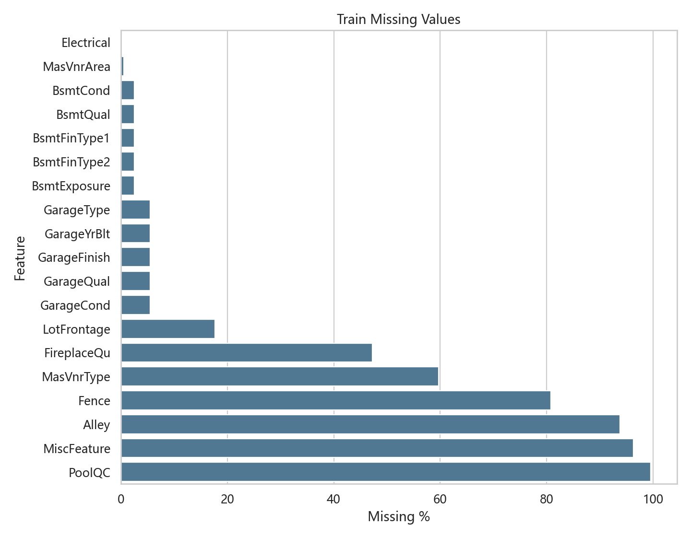
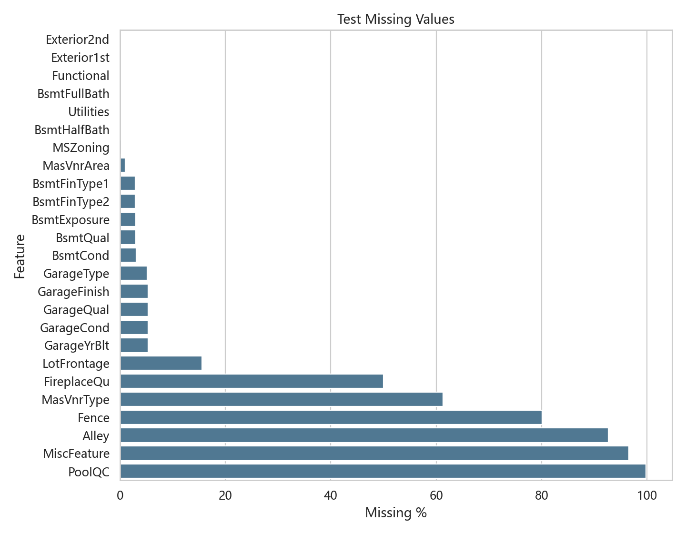
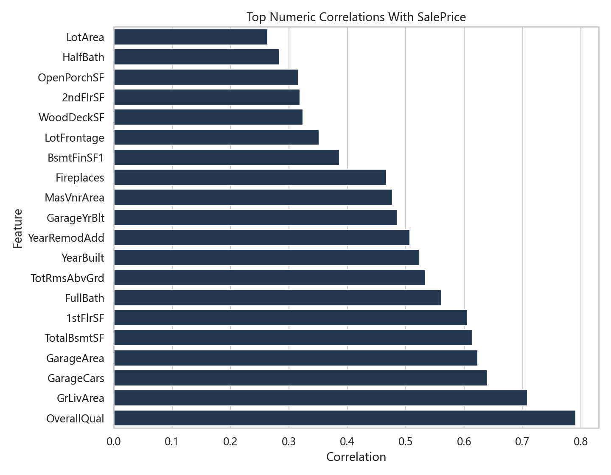
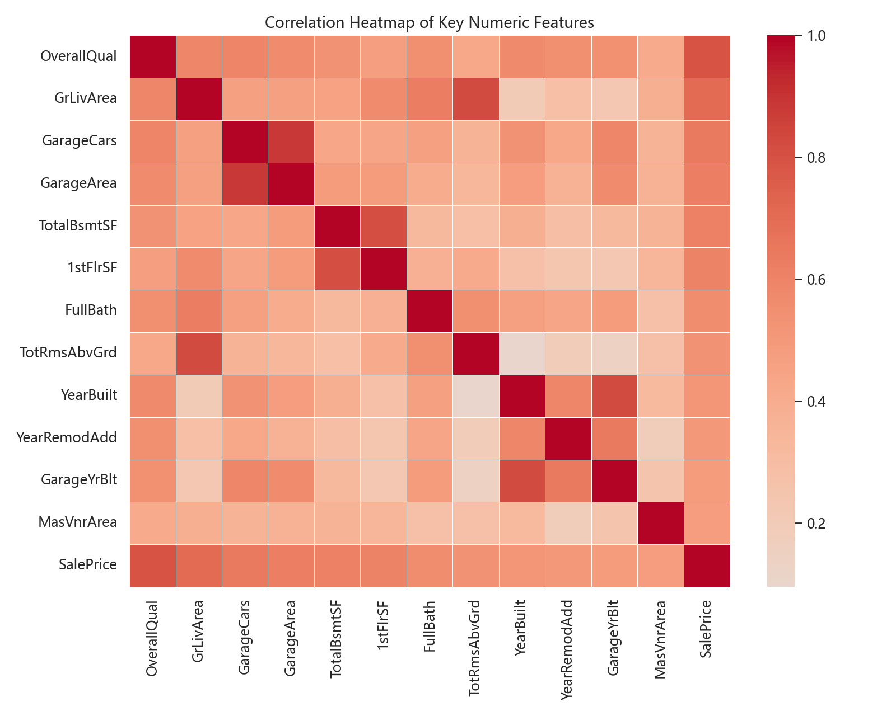
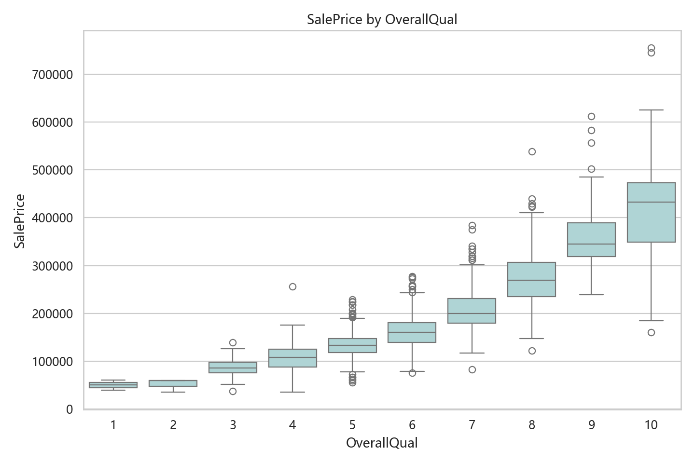
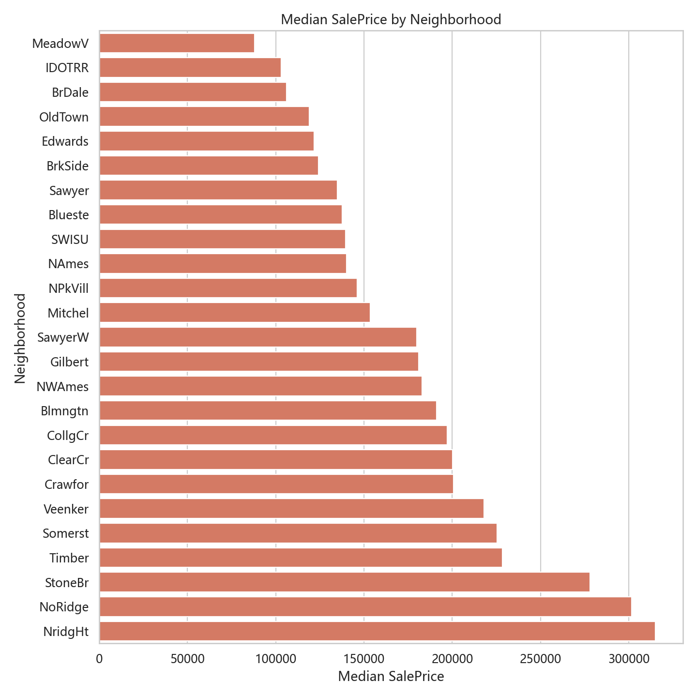
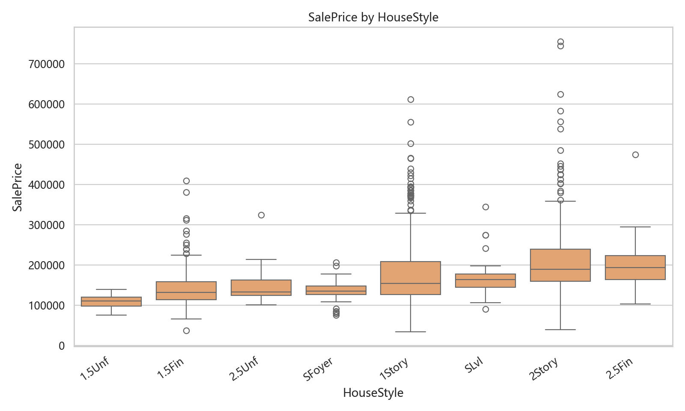
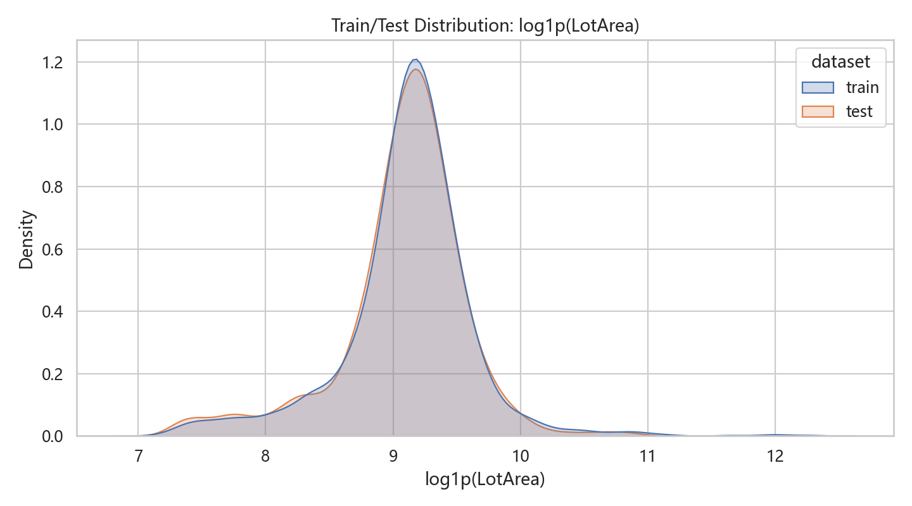
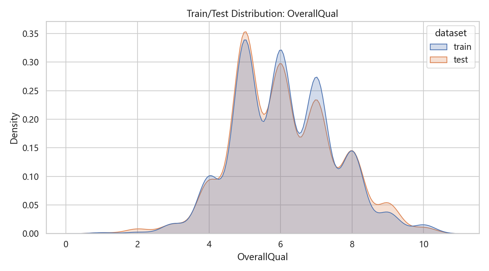

# House Prices 完整探索性分析报告

## 1. 报告目的

这份报告单独补充 Kaggle House Prices 题目的探索性分析，目标是为后续建模、复盘和正式报告提供图表与数据依据。

本报告覆盖：

- 数据规模和字段类型
- 目标值 `SalePrice` 分布
- 缺失值结构
- 数值特征相关性
- 类别特征与价格关系
- 异常点识别
- 训练集和测试集分布差异
- 对建模策略的启发

## 2. 数据概览

| dataset | rows | columns | missing_cells | duplicate_rows |
| --- | --- | --- | --- | --- |
| train | 1460 | 81 | 7829 | 0 |
| test | 1459 | 80 | 7878 | 0 |
| sample_submission | 1459 | 2 | 0 | 0 |

训练集比测试集多出的字段是 `SalePrice`，也就是本题的预测目标。

字段类型统计：

| dtype | count |
| --- | --- |
| str | 43 |
| int64 | 35 |
| float64 | 3 |

## 3. 目标值 SalePrice 分析

| metric | SalePrice | log1p_SalePrice |
| --- | --- | --- |
| count | 1460.0000 | 1460.0000 |
| mean | 180921.1959 | 12.0241 |
| std | 79442.5029 | 0.3994 |
| min | 34900.0000 | 10.4603 |
| 25% | 129975.0000 | 11.7751 |
| 50% | 163000.0000 | 12.0015 |
| 75% | 214000.0000 | 12.2737 |
| max | 755000.0000 | 13.5345 |
| skew | 1.8829 | 0.1213 |

`SalePrice` 原始偏度为 `1.8829`，右偏明显；`log1p(SalePrice)` 后偏度为 `0.1213`，分布更接近对称。

建模启发：Kaggle 该题的 RMSLE 指标等价于在 log 价格上计算 RMSE，因此目标值使用 `log1p(SalePrice)` 是合理且必要的。

## 4. 缺失值分析

训练集缺失值 Top 10：

| feature | missing | missing_pct |
| --- | --- | --- |
| PoolQC | 1453 | 99.5200 |
| MiscFeature | 1406 | 96.3000 |
| Alley | 1369 | 93.7700 |
| Fence | 1179 | 80.7500 |
| MasVnrType | 872 | 59.7300 |
| FireplaceQu | 690 | 47.2600 |
| LotFrontage | 259 | 17.7400 |
| GarageType | 81 | 5.5500 |
| GarageYrBlt | 81 | 5.5500 |
| GarageFinish | 81 | 5.5500 |

测试集缺失值 Top 10：

| feature | missing | missing_pct |
| --- | --- | --- |
| PoolQC | 1456 | 99.7900 |
| MiscFeature | 1408 | 96.5000 |
| Alley | 1352 | 92.6700 |
| Fence | 1169 | 80.1200 |
| MasVnrType | 894 | 61.2700 |
| FireplaceQu | 730 | 50.0300 |
| LotFrontage | 227 | 15.5600 |
| GarageQual | 78 | 5.3500 |
| GarageCond | 78 | 5.3500 |
| GarageYrBlt | 78 | 5.3500 |

关键观察：

- `PoolQC`、`MiscFeature`、`Alley`、`Fence` 缺失比例极高，多数情况下不是脏数据，而是表示房子没有对应设施。
- `Garage*` 和 `Bsmt*` 系列字段的缺失往往成组出现，通常表示没有车库或地下室。
- `LotFrontage` 缺失较多，适合按 `Neighborhood` 分组中位数填充。
- 测试集存在少量训练集中没有缺失、测试集中有缺失的字段，预测前必须统一处理。

## 5. 数值特征与 SalePrice 的关系

相关性最高的数值特征：

| feature | corr_with_saleprice |
| --- | --- |
| OverallQual | 0.7910 |
| GrLivArea | 0.7086 |
| GarageCars | 0.6404 |
| GarageArea | 0.6234 |
| TotalBsmtSF | 0.6136 |
| 1stFlrSF | 0.6059 |
| FullBath | 0.5607 |
| TotRmsAbvGrd | 0.5337 |
| YearBuilt | 0.5229 |
| YearRemodAdd | 0.5071 |

关键观察：

- `OverallQual` 与价格关系最强，是最重要的单一数值特征。
- `GrLivArea`、`GarageCars`、`GarageArea`、`TotalBsmtSF`、`1stFlrSF` 都和面积或容量相关，说明房屋规模是核心信号。
- `YearBuilt`、`YearRemodAdd` 有明显正相关，新房和较新翻修的房子通常更贵。

## 6. 质量、街区和类别特征

`OverallQual` 分组价格统计：

| OverallQual | count | mean | median | min | max |
| --- | --- | --- | --- | --- | --- |
| 1.0000 | 2.0000 | 50150.0000 | 50150.0000 | 39300.0000 | 61000.0000 |
| 2.0000 | 3.0000 | 51770.3300 | 60000.0000 | 35311.0000 | 60000.0000 |
| 3.0000 | 20.0000 | 87473.7500 | 86250.0000 | 37900.0000 | 139600.0000 |
| 4.0000 | 116.0000 | 108420.6600 | 108000.0000 | 34900.0000 | 256000.0000 |
| 5.0000 | 397.0000 | 133523.3500 | 133000.0000 | 55993.0000 | 228950.0000 |
| 6.0000 | 374.0000 | 161603.0300 | 160000.0000 | 76000.0000 | 277000.0000 |
| 7.0000 | 319.0000 | 207716.4200 | 200141.0000 | 82500.0000 | 383970.0000 |
| 8.0000 | 168.0000 | 274735.5400 | 269750.0000 | 122000.0000 | 538000.0000 |
| 9.0000 | 43.0000 | 367513.0200 | 345000.0000 | 239000.0000 | 611657.0000 |
| 10.0000 | 18.0000 | 438588.3900 | 432390.0000 | 160000.0000 | 755000.0000 |

房屋整体质量越高，价格中位数越高，这个关系非常稳定。

房价中位数最高的街区：

| Neighborhood | count | mean | median | min | max |
| --- | --- | --- | --- | --- | --- |
| NridgHt | 77 | 316270.6200 | 315000.0000 | 154000 | 611657 |
| NoRidge | 41 | 335295.3200 | 301500.0000 | 190000 | 755000 |
| StoneBr | 25 | 310499.0000 | 278000.0000 | 170000 | 556581 |
| Timber | 38 | 242247.4500 | 228475.0000 | 137500 | 378500 |
| Somerst | 86 | 225379.8400 | 225500.0000 | 144152 | 423000 |
| Veenker | 11 | 238772.7300 | 218000.0000 | 162500 | 385000 |
| Crawfor | 51 | 210624.7300 | 200624.0000 | 90350 | 392500 |
| ClearCr | 28 | 212565.4300 | 200250.0000 | 130000 | 328000 |
| CollgCr | 150 | 197965.7700 | 197200.0000 | 110000 | 424870 |
| Blmngtn | 17 | 194870.8800 | 191000.0000 | 159895 | 264561 |

房价中位数最低的街区：

| Neighborhood | count | mean | median | min | max |
| --- | --- | --- | --- | --- | --- |
| MeadowV | 17 | 98576.4700 | 88000.0000 | 75000 | 151400 |
| IDOTRR | 37 | 100123.7800 | 103000.0000 | 34900 | 169500 |
| BrDale | 16 | 104493.7500 | 106000.0000 | 83000 | 125000 |
| OldTown | 113 | 128225.3000 | 119000.0000 | 37900 | 475000 |
| Edwards | 100 | 128219.7000 | 121750.0000 | 58500 | 320000 |
| BrkSide | 58 | 124834.0500 | 124300.0000 | 39300 | 223500 |
| Sawyer | 74 | 136793.1400 | 135000.0000 | 62383 | 190000 |
| Blueste | 2 | 137500.0000 | 137500.0000 | 124000 | 151000 |
| SWISU | 25 | 142591.3600 | 139500.0000 | 60000 | 200000 |
| NAmes | 225 | 145847.0800 | 140000.0000 | 87500 | 345000 |

建模启发：`Neighborhood` 不只是普通类别变量，它携带了强烈的位置溢价信息；质量类字段适合做序数编码，而不是全部简单 one-hot。

## 7. 年份变量

关键观察：新建年份和翻新年份越新，价格整体越高。后续特征工程中构造 `HouseAge`、`RemodAge`、`IsNewHouse` 是有依据的。

## 8. 异常点分析

候选异常点：

| Id | SalePrice | GrLivArea | LotArea | OverallQual | TotalBsmtSF | GarageCars | Neighborhood | YearBuilt |
| --- | --- | --- | --- | --- | --- | --- | --- | --- |
| 692 | 755000 | 4316 | 21535 | 10 | 2444 | 3 | NoRidge | 1994 |
| 1183 | 745000 | 4476 | 15623 | 10 | 2396 | 3 | NoRidge | 1996 |
| 1170 | 625000 | 3627 | 35760 | 10 | 1930 | 3 | NoRidge | 1995 |
| 899 | 611657 | 2364 | 12919 | 9 | 2330 | 3 | NridgHt | 2009 |
| 804 | 582933 | 2822 | 13891 | 9 | 1734 | 3 | NridgHt | 2008 |
| 1047 | 556581 | 2868 | 16056 | 9 | 1992 | 3 | StoneBr | 2005 |
| 441 | 555000 | 2402 | 15431 | 10 | 3094 | 3 | NridgHt | 2008 |
| 770 | 538000 | 3279 | 53504 | 8 | 1650 | 3 | StoneBr | 2003 |
| 314 | 375000 | 2036 | 215245 | 7 | 2136 | 2 | Timber | 1965 |
| 707 | 302000 | 1824 | 115149 | 7 | 1643 | 2 | ClearCr | 1971 |
| 452 | 280000 | 1533 | 70761 | 7 | 1533 | 2 | ClearCr | 1975 |
| 250 | 277000 | 2144 | 159000 | 6 | 1444 | 2 | ClearCr | 1958 |
| 336 | 228950 | 1786 | 164660 | 5 | 1499 | 2 | Timber | 1965 |
| 524 | 184750 | 4676 | 40094 | 10 | 3138 | 3 | Edwards | 2007 |
| 1299 | 160000 | 5642 | 63887 | 10 | 6110 | 2 | Edwards | 2008 |
| 1397 | 160000 | 1687 | 57200 | 5 | 747 | 2 | Timber | 1948 |

最重要的两个异常点是：

- `Id=524`：`GrLivArea=4676`，但 `SalePrice=184750`
- `Id=1299`：`GrLivArea=5642`，但 `SalePrice=160000`

这两个点面积极大但价格偏低，会破坏面积和价格之间的主要趋势。因此 baseline 和后续模型中删除它们是合理的。

## 9. 训练集与测试集分布差异

数值特征分布差异 Top 10，按 KS statistic 排序：

| feature | train_mean | test_mean | mean_diff | ks_stat | ks_pvalue |
| --- | --- | --- | --- | --- | --- |
| Id | 730.5000 | 2190.0000 | 1459.5000 | 1.0000 | 0.0000 |
| 2ndFlrSF | 346.9925 | 325.9678 | -21.0247 | 0.0471 | 0.0737 |
| GrLivArea | 1515.4637 | 1486.0459 | -29.4178 | 0.0464 | 0.0817 |
| TotRmsAbvGrd | 6.5178 | 6.3852 | -0.1326 | 0.0449 | 0.1001 |
| TotalBsmtSF | 1057.4295 | 1046.1180 | -11.3115 | 0.0413 | 0.1601 |
| MoSold | 6.3219 | 6.1042 | -0.2177 | 0.0378 | 0.2415 |
| LotArea | 10516.8281 | 9819.1611 | -697.6670 | 0.0372 | 0.2559 |
| YearRemodAdd | 1984.8657 | 1983.6628 | -1.2030 | 0.0372 | 0.2577 |
| LotFrontage | 70.0500 | 68.5804 | -1.4696 | 0.0308 | 0.5950 |
| BsmtUnfSF | 567.2404 | 554.2949 | -12.9455 | 0.0303 | 0.5021 |

类别特征中，训练集和测试集存在取值差异的字段：

| feature | train_unique | test_unique | test_only_levels | train_only_levels | has_level_difference |
| --- | --- | --- | --- | --- | --- |
| Condition2 | 8 | 5 |  | RRAe, RRAn, RRNn | True |
| Electrical | 5 | 4 |  | Mix | True |
| Exterior1st | 15 | 13 |  | ImStucc, Stone | True |
| Exterior2nd | 16 | 15 |  | Other | True |
| GarageQual | 5 | 4 |  | Ex | True |
| Heating | 6 | 4 |  | Floor, OthW | True |
| HouseStyle | 8 | 7 |  | 2.5Fin | True |
| MiscFeature | 4 | 3 |  | TenC | True |
| PoolQC | 3 | 2 |  | Fa | True |
| RoofMatl | 8 | 4 |  | ClyTile, Membran, Metal, Roll | True |
| Utilities | 2 | 1 |  | NoSeWa | True |

建模启发：训练集和测试集整体结构接近，但某些稀有类别只在训练集出现。预处理时应该合并 train/test 后统一编码，避免 one-hot 列不一致。

## 10. 低方差特征

| feature | top_value | top_pct | unique_values |
| --- | --- | --- | --- |
| Utilities | AllPub | 99.9300 | 2 |
| Street | Pave | 99.5900 | 2 |
| PoolArea | 0 | 99.5200 | 8 |
| PoolQC | nan | 99.5200 | 4 |
| Condition2 | Norm | 98.9700 | 8 |
| 3SsnPorch | 0 | 98.3600 | 20 |
| RoofMatl | CompShg | 98.2200 | 8 |
| LowQualFinSF | 0 | 98.2200 | 24 |
| Heating | GasA | 97.8100 | 6 |
| MiscVal | 0 | 96.4400 | 21 |
| MiscFeature | nan | 96.3000 | 5 |
| KitchenAbvGr | 1 | 95.3400 | 4 |

这些字段绝大多数样本取同一个值，单独信息量有限。不过在树模型或特定交互中仍可能有少量价值，暂时不必全部删除。

## 11. 对建模的总结启发

这次 EDA 支持以下建模策略：

1. 目标值使用 `log1p(SalePrice)`。
2. 删除 `GrLivArea` 极大但价格异常低的两个训练样本。
3. 缺失值需要按业务含义处理，不能简单全部均值填充。
4. `OverallQual`、面积类、车库、地下室、年份和街区是主信号。
5. 质量类字段适合序数编码。
6. 面积类和部分数值特征右偏明显，适合 `log1p` 变换。
7. train/test 编码必须统一处理，避免类别列不一致。
8. 高价预测容易外推，后续模型需要关注高价区间和预测裁剪。

## 12. 输出文件

图表目录：

`D:\pythonDev\PythonProject\Kaggle_house_price\reports\eda\figures`

表格目录：

`D:\pythonDev\PythonProject\Kaggle_house_price\reports\eda\tables`

本报告路径：

`D:\pythonDev\PythonProject\Kaggle_house_price\reports\eda\20260506_full_eda_report.md`